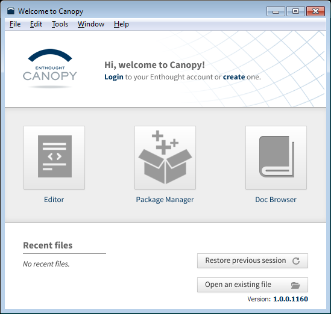
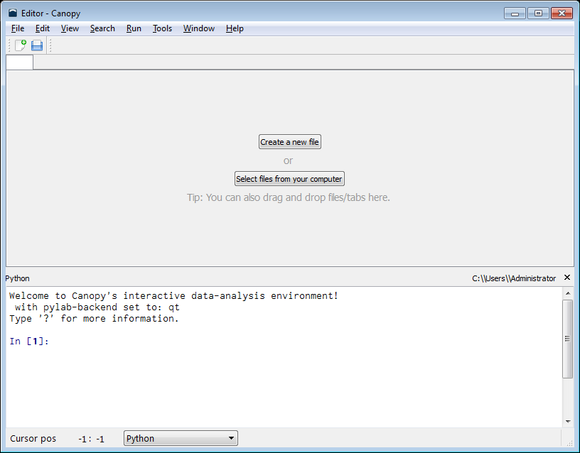
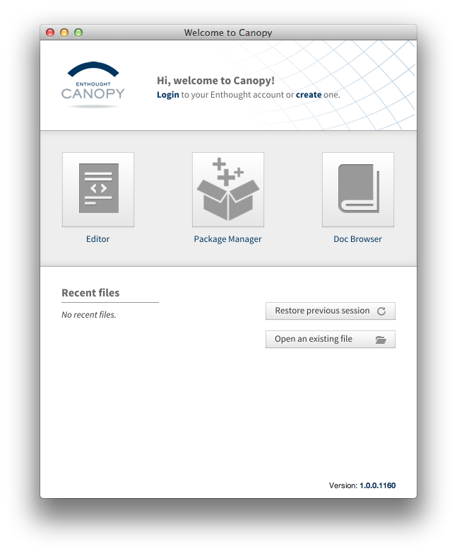
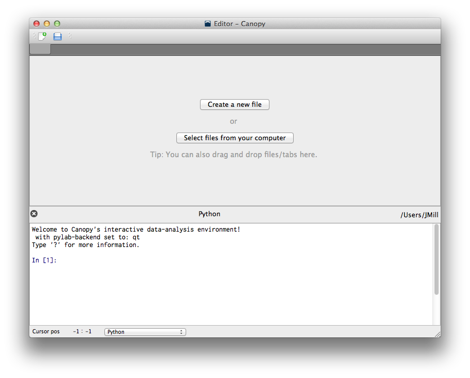
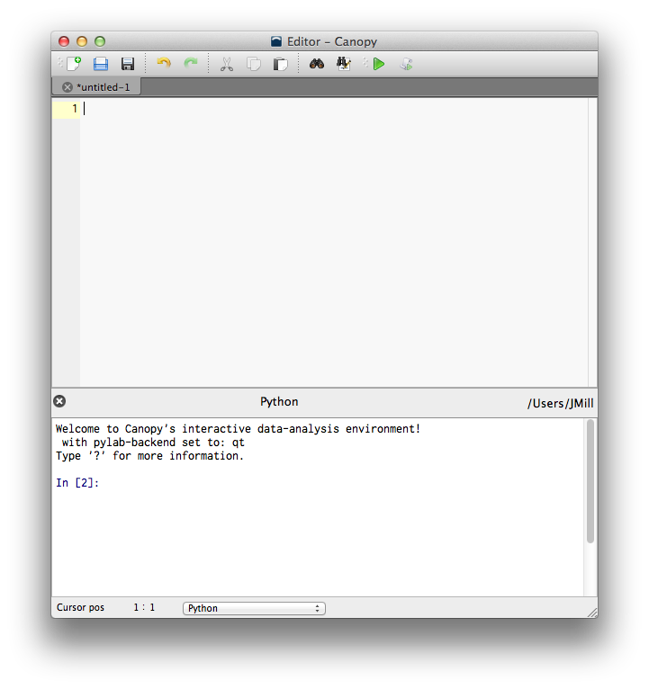
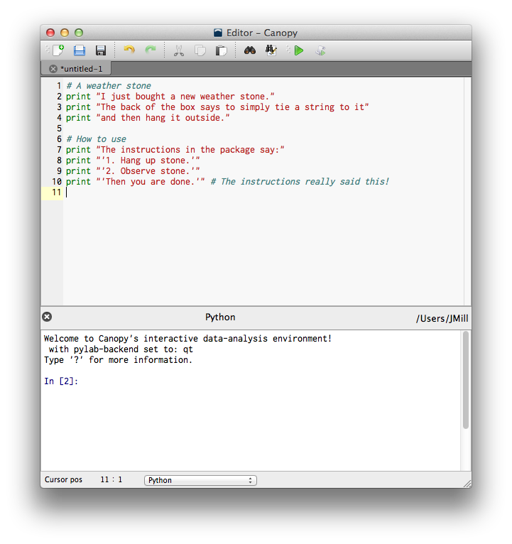
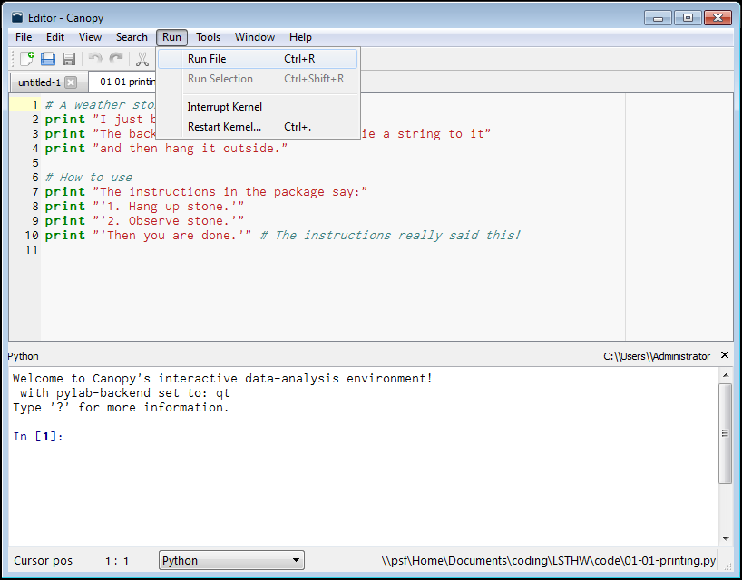
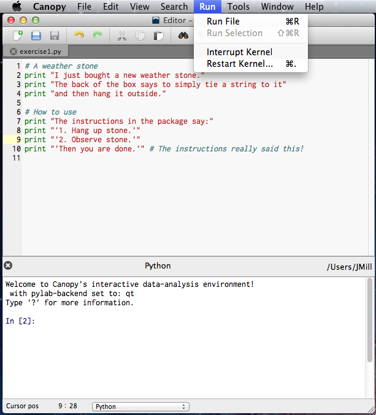
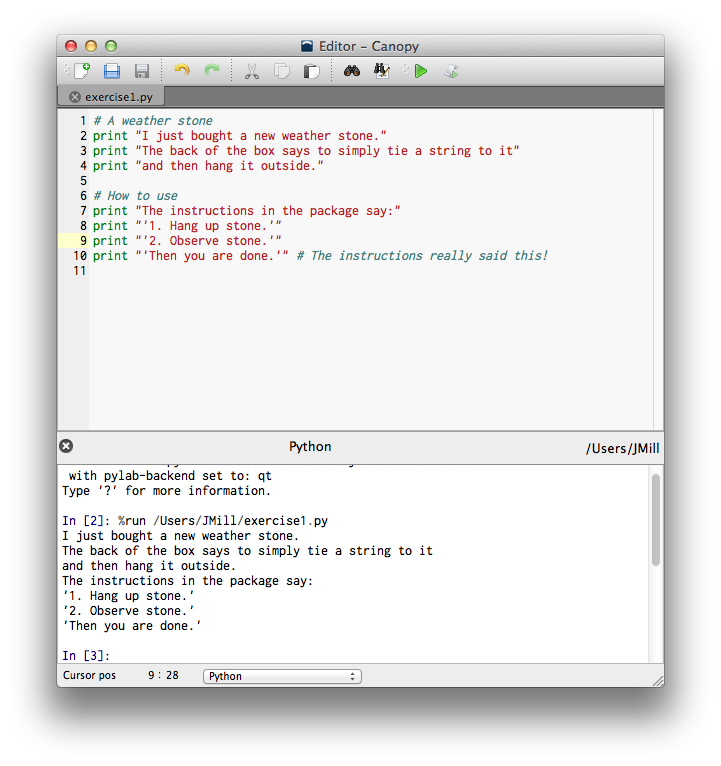



Exercise 0: Meet Python
*************************

Back in modern stats' infancy, when Florence Nightingale was busy counting dead and dying soldiers, she did all of her calculations by hand.

Surely you've already done enough math by hand and, by extension, with a calculator. It's time to take off the training wheels and give you a real calculator, one much more powerful than what was used to put people on the moon. [#]_ Instead of punching an endless sequence of numbers on a hand calculator, you'll instead be *writing* to your computer and it will write back. This back-and-forth of writing is called **programming**, or just **coding**. It's how we talk with computers to make them do stuff, and for them to tell us neat stuff in return. 

Lets introduce you to Python. These are the steps to perform to get your computer set up. We will use the Enthought Canopy package.  [#]_ Follow these instructions as exactly as possible.

Windows
============================

1. Go to http://www.enthought.com/canopy-express/ with your browser and download Canopy Express.  If you are asked to create an account first, do so.
#. Go to your downloads folder and double-click the Canopy installer.
#. Follow the prompts (Click "Next" a bunch of times) to finish the installation.
#. Double-click the Enthought Canopy Express icon on your desktop.

Windows: What You Should See
---------------------------------------------

On my computer, one window appears.  It is a welcome screen and shows this:

|Windowswelcome|

Click the *Editor* button.  The *Editor* window will appear:

|Wineditor|

Click *Create a new file*.

Mac OSX
============================ 

1. Go to http://www.enthought.com/canopy-express/ with your browser and download Canopy Express.  If you are asked to create an account first, do so.
#. Go to your downloads folder and double-click the Canopy installer.
#. Install Canopy by drag-and-dropping the Canopy icon into your Applications folder.
#. Go to your Applications folder and click the *Canopy* icon.

OSX: What You Should See
------------------------------------------
On my computer, one window appears.  It is a welcome screen and shows this:

|Macwelcome|

Click the *Editor* button.  The *Editor* window will appear:

|Maceditor|

Click *Create a new file*.

    

Linux
============================
There are many flavors of Linux with a multitude of installation options. If you're using Linux you are probably comfortable with how to install packages. The general approach is to:

1. Go to http://www.enthought.com/canopy-express/ with your browser and download Canopy Express.  If you are asked to create an account first, do so.
#. Go to your downloads folder and double-click the Canopy installer.
#. Follow the prompts (Click "Next" a bunch of times) to finish the installation.
#. In your Applications folder, click Enthought Canopy Express.

.. [#] Even playing the game *Angry Birds* performs more math than the moon rocket launch.
.. [#] While OSX comes with Python already, it doesn't have some extra stuff like graph-making abilities, so we are going to use the Enthought Python distribution.

Exercise 1: How is the weather?
********************************

Statistics is about using data to inform decisions.

**Data** :math:`\rightarrow` **Decisions**

You do this all the time already, so there is nothing amazing happening.

Looks like rain
=================
Lets say you're about to leave your home for some morning chores. Upon opening the front door you notice that it's raining. You'd likely consider retrieving a rain coat before heading outside.

**Seeing Rain** *(is the data)* :math:`\rightarrow` **Wearing raincoat** *(is your decision)*

Even as kids, most of us regularly make decisions like this.

Your first program
==================================
To ease you into thinking statistically, you will type simple commands.

In the Editor, create a new file if you didn't already do so in the previous exercise.  You will see a blank editor area and a blank *Python* area. 

|macemptyeditor|

You will type stuff into the top section and, later, that stuff will cause other things to be displayed in the bottom section.

When I write 'type the code', or 'create a new file', this is the window to which I'm referring, specifically the top section.

Write the following code in the editor. Do not copy and paste. **Type each and every character exactly as typed below.**  

|printinginput|

Then save what you wrote by clicking File | Save As... 

Name this file ``exercise1.py``.  While it doesn't matter where you save the file, I put mine in a new folder called "Learning Stats". You should, too.

Then click Run | Run Module. On Windows this looks like:

|Windowsrunmoduleprinting|

On Mac, the Run | Run Module menu looks like this:

|Macrunmoduleprinting|

What you should see
==================================
Upon clicking "Run Module", Python will respond with the following if you typed it correctly. (Look at the bottom section, below where it says *Python*.)

|printingoutput|

If you didn't get the same thing I did, then carefully go through the code line-by-line. One incorrect symbol can cause things to run improperly, if at all.

.. NOTE::
    Notice that single (') or double (") quotes can be used. You just have to be consistent within each line of code. When in doubt, use double quotes.

Exercise 2: Lets go to the desert
***********************************

In this exercise we'll make a decision based on data that's not as obvious as "it's raining" from the previous exercise.

Lets say I'm planning a trip for next May to visit a friend in Phoenix, Arizona, USA. I've never been there and live nowhere near there, so I'd like help in making a decision as to what types of clothing to pack for a 1 week trip.  Being an extreme introvert, I'd never consider asking my friend for suggestions...

Knowing the expected high temperature for Phoenix in May would be useful. I did some research and found that the average high temperature is 93.6 :math:`^\circ` F.  Put another way, across the past decades, Phoenix has had May high temperatures higher than 93.6 :math:`^\circ` F, such as 100.0 :math:`^\circ` F and also high temperatures lower than 93.6 :math:`^\circ` F, such as 85.0 :math:`^\circ` F.  

While temperature is definitely important, it doesn't give us a complete sense of the Phoenix climate, such as precipitation.  We now know Phoenix is quite warm, but is it humid like a jungle or dry like a desert?  The average precipitation for Phoenix in May is 0.1 inches. Phoenix appears to be arid, like a desert.

By knowing only the average high temperature and average precipitation, you can conjure a mental image of the Phoenix weather. Odds are, I won't need a rain poncho or arctic coat. Maybe sunglasses and flip-flops.

The process we just performed can be organized like this:

**Gather info** *(historical weather data)* :math:`\rightarrow` **Predict future** *(the likely temps and precipitation)* :math:`\rightarrow` **Make decision** *(take sunblock)*

With Python
======================

Before we can make interesting predictions and decisions, you have to get more familiar with Python.  It will take practice and will be hard and confusing, but it will be worth it.

Open a new window in IDLE. Type in the following code exactly. Remember, do not copy and paste. 

.. NOTE::
    For this and future exercises, I will not show you screenshots of my computer screen. Instead, I'll show you the code like below, which you will type in to your computer.
 
 
{{ ork.code('code/lab01-02-01-printing_math.py|pyg') }}

Save this file as ex2-phoenix_weather.py. Then click Run. 

(That ``_`` character is called "underscore". Look up how to type it with your keyboard. It's very commonly used when writing code.)

What you should see
============================

Here is what the output of that program would look like::

    {{ d['code/lab01-02-01-printing_math.py|py']|indent(4) }}

Study Drills
==============
- Look up historical weather data for someplace you may visit in the future. Before looking at the data, think to yourself what you'd *expect* the data to look like (high temperatures, amount of precipitation, etc.).  Use http://climate-zone.com, http://weatherspark.com, or http://accuweather.com.
- What if you and your friend want to camp in a tent? What do the nighttime temperatures look like? Most weather data sources don't provide "nighttime" temperatures.  What data that *is* provided likely corresponds to nighttime temperatures?  Average high temperature? Average low temperature? Something else?
- In the code you typed above, what do you think the %s does?  See if you can change what appears in the %s locations without modifying a %s.

