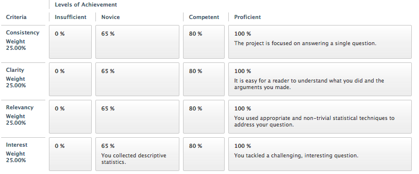



Project Guide
****************************

Project Due Dates
===================

* Proposal: Tuesday, December 3rd.* Send to `jmiller@francis.edu <jmiller@francis.edu>`_ 
* Report: Friday, December 13th.* Send via link in Blackboard.

For the data analysis project, you address some questions that interest you with the statistical methodology we've learned in Statistics 101.   You choose the question; you decide how to collect data; you do the analyses.  The questions can address almost any topic (although I have veto power), including topics in politics, economics, psychology, sociology, natural science, medicine, public policy, sports, law, etc.

The project requires you to synthesize all the material from the course.  Hence, it's one of the best ways to solidify your understanding of statistical methods.  Additionally, you get answers to issues that pique your intellectual curiosity.

You should work in groups of one to three people. 

You have learned many statistical techniques, such as hypothesis testing, confidence intervals, and regression. These techniques will help you address your question of interest. 

Project Ideas
===============

The most important aspects of any statistical analysis are stating questions and collecting data.  To get the full experience of running your own study, the project requires you to analyze data that you collect.   It is not permissible to use statistical reports that have been put together by others.  You are permitted to collect data from the web; however, you must be the one who decides on the analyses and puts the report together.

Good projects begin with very clear and well-defined hypotheses. You should think of questions that interest you first, then worry about how to collect and analyze data to address those questions.   Generally, vague topics lead to uninteresting projects. For example, surveying university undergraduates to see which sex studies more doesn't yield a whole lot of interesting conclusions.   On the other hand, it would be interesting to hypothesize why men or women study more, and then figure out how to collect and analyze data to test your hypotheses.

`Here is a list <project-ideas.html>`_ of some project topics that have been done by past statistics students. Consider the list a tool for generating ideas.

It is important to be thoughtful about, and provide an adequate description of, the methods and design of the study.  Report on the possible biases associated with your data collection.  You also need to be realistic in planning your research design: can you carry out what you have planned within a reasonable time period and investment of your own energy? The quality of the final product is what counts, not just the amount of perspiration that went into it!  Finally, you should make use of the concepts and methods learned in this course, and not just general knowledge, in planning and completing this type of project.

Practical Advice: It is often easier to collect accurate experimental data than accurate survey data. Nonresponse tends to be less of an issue with projects based on experiments than with those based on surveys.  I strongly encourage you to consider experiments as opposed to surveys.  For those who want to do surveys, consider using students in dorms or certain courses as target populations.  Make every effort to get a random sample, and try to keep track of the characteristics of nonrespondents.  You will have nonresponse; your project won't be penalized for nonresponse as long as you document it and hypothesize how it might affect your results.

More Practical Advice: Use whatever tools you need to perform your analysis. Whether you use Python, Excel, or other software, document what you used.

Project proposal
==================

Your group should hand in one project proposal (with all group members' names on it) by the proposal due date given above. Email the proposal to jmiller@francis.edu. The proposal is a page or so describing what you plan to do. Be as specific as possible, describing what question you want to investigate and generally how you plan to obtain data. The instructor and TAs will return the proposals to you with comments.  The more detailed your proposal, the better feedback you get!  Your proposal should address the following questions:

- What is the topic of your project?
- What are the main issues or problems you plan to address?
- What are your plans for obtaining background information (if needed) about your project?
- Describe the data that you plan on using or collecting, including the variables measured. You don't have to give a detailed version of your data collection design; you will hand in detailed design plans on the design due date given above.
- What questions and/or concerns do you have about your project?
The project proposal is not graded.  It exists primarily for you to get feedback on your project idea.

Project grading guidelines
============================

You will be graded based on the following characteristics:

- Consistency: Did you answer your question of interest?
- Clarity: Is it easy for your reader to understand what you did and the arguments you made?
- Relevancy: Did you use statistical techniques wisely to address your question?
- Interest: Did you tackle a challenging, interesting question (good), or did you just collect descriptive statistics (bad)?

|project-rubric|

Some suggestions for scoring high on these criteria, and suggestions you should keep in mind whenever you write anything, are the following:
Know you audience. In this case, you should compose the report for an audience of Statistics 101 students. 
State your question up front, and use statistics to help answer it. The statistics should not drive the question; the question should drive the statistics.
Don't just collect data and publish it. Rather, have a specific question in mind. Otherwise, you wind up being hard-pressed to come up with something challenging and interesting.
Most importantly, you can ask me for advice. You can ask me, for example, about your planned methods of analysis.
Be selective with computer output to help clarity.
If you are using techniques we learned in class, you do not have to re-explain the techniques. That hurts clarity. If you are using techniques that we did not cover in class, you should definitely explain the techniques. That is clarity!

