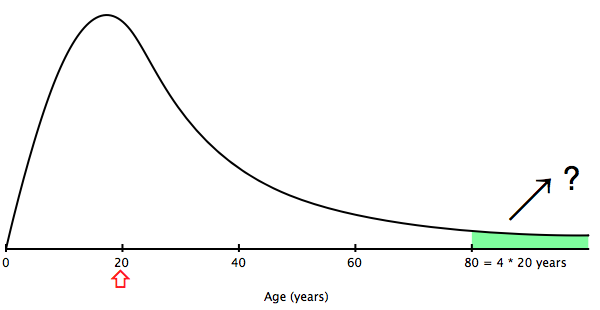


Measures of Location - Mode and Markov Inequality
**************************************************

Markov Inequality
=====================

Here's a question:

**The average age of a group of people is 20 years. What proportion are more than 80 years old? Not many.**

We don't have enough information to say exactly what proportion are over 80 years old. We can't even give an approximation of the proportion.

Yet, Andrey Markov (1856-1922) devised a simple bound.

Here's a tail bound:

|markov-tail01|

Here's Markov's Inequality applied to a tail bound:

|markov-tail02|

.. |markov-tail02| image:: images/s02l02-tailbound-markov.png

Formal statement of Markov's Inequality
---------------------------------------------

Let :math:`k` be any positive number. If a list has only non-negative entries, then the proportion of entries that are at least as large as :math:`k` times the average is at most :math:`\frac{1}{k}`.

You can interpret *as least as large* as meaning the same thing as *greater than or equal*, represented as :math:`\geq`

*at most* means the same thing as *no more than*.

Examples
~~~~~~~~~~~~~

In any list of non-negative numbers (e.g, 0, 1, 3.40, 99.5 ...), the proportion of entries that are at least as large as 4 times the average is **at most 1/4**. In other words, **no more than 25%.**

Another example:

In any non-negative list, the proportion of entries that are at least as large as 10 times the average can be **no more than 1/10.**

These results are **bound**, not actual answers, nor approximations, nor estimates.

- The proportion could be exactly :math:`\frac{1}{10}`
- it could be quite a bit less than :math:`\frac{1}{10}`
- it could even be 0
- but it **cannot be more than** :math:`\frac{1}{10}`

Back to the '80 year old' example
------------------------------------

Here's the question again:

**The average age of a group of people is 20 years. What proportion are more than 80 years old?**

We can't say exactly, or even approximately, but we can try Markov:

	80 is 4 times the average, so the proportion is **at most** :math:`\frac{1}{4}`

There's a bit of a nuance, though.

- The question asked: *more than 80* years old. :math:`\gt 80`
- Markov answered: *greater than or equal to 80* years old: :math:`\geq 80`

So, the proportion that are *more than 80* years old is at most the proportion that are *greater than or equal to 80* years old. And that proportion is at most :math:`\frac{1}{4}`, by Markov's inequality.

