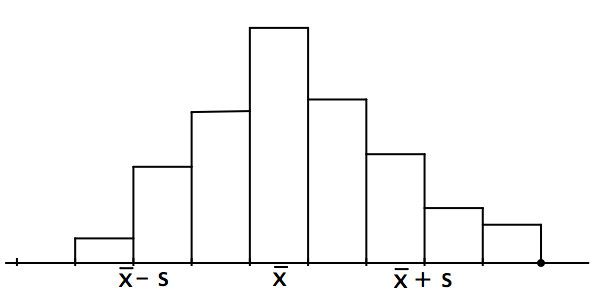
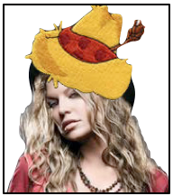
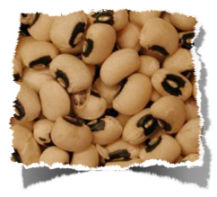
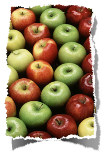


Measures of Spread
**************************************************

Variance and its association with Standard Deviation
=========================================================

The standard measure of spread is the *standard deviation.* Unlike the inter-quartile range (IQR) [#]_, which is based on medians, the standard deviation measures the spread from the mean. You can think of it, roughly, as the average disntance of the data from the mean :math:`\overline{x}`.

Variance
~~~~~~~~~~~~

However, we use the squares of the distances instead. That is, if the squared distance of point :math:`x_i` to :math:`\overline{x}` is :math:`(x_i - \overline{x})^2`, then 

.. math::

	\text{average squared distance} = \frac{1}{n} \sum\limits_{i=1}^n (x_i - \overline{x})^2

For technical reasons, we use :math:`n-1` in the denominator rather than :math:`n`, and define the **sample variance** :math:`s^2` as

.. math::

	\text{variance} = s^2 = \frac{1}{n-1}\sum\limits_{i=1}^n(x_i-\overline{x})^2

Example of variance
~~~~~~~~~~~~~~~~~~~~~~

For the data set :math:`\{3, 5, 7, 7, 38\}`, with the average :math:`\overline{x} = 12` and total number of data values :math:`n = 5` we calculate the variance:

.. math::

	\begin{split}
	s^2 &= \frac{(3-12)^2 + (5-12)^2 + (7-12)^2 + (7-12)^2 + (38-12)^2}{(5-1)}\\
	&= \frac{81+49+25+25+676}{4}\\
	&= 214
	\end{split}

This is a large variance, and represents the wide spread of the data.

We have a problem, though. A measure of spread should have the same *units* as the originnal data. In the example of stdent weights, the variance :math:`s^2` is measured in pounds *squared*. Ugh. The obvious solution is to take the square root of the variance, and so we do. Thus, we define **standard deviation**

The standard deviation
~~~~~~~~~~~~~~~~~~~~~~~~~

The standard deviation :math:`s` is the square root of the variance :math:`s^2`.

.. math::

	s = \sqrt{s^2} = \sqrt{\frac{1}{n-1}\sum\limits_{i=1}^n(x_i-\overline{x})^2}

For the simple example dataset above, :math:`s = \sqrt{214} = \textbf{14.63}`

Even for small datasets, calculating the needed arithmetic for standard deviation gets dull very quickly. That's why we've started to use computers to help us with the calculations. For this course, we'll be working with the Python programming language because it is user friendly and powerful.

:math:`z` score, apples, and oranges
=======================================

The mean :math:`\overline{x}` and standard deviation :math:`s` are very good for summarizing the propertise of fairly **symmetrical histograms without outliers**. In other words, histograms shaped like mounds.

|mean-and-stdev|

It's often useful to know how many standard deviations a data point is from the mean, :math:`\overline{x}`. :math:`z` scores show the position of any given data value, in standard deviation units. :math:`z` scores are also called **standardized scores**, and is the distance of a value from :math:`\overline{x}` *per standard deviation.* If we wrote the previous sentence as an equation, it'd look like:

.. math::

	z_i = \frac{x_i - \overline{x}}{s} \text{ for each } i

A :math:`z` score of :math:`z = +2` means that an observation is *two standard deviations above the mean.* A score of 0 means the observation is at the mean. A score of :math:`z = -2.3` is 2.3 standard deviations below the mean.

:math:`z` scores are neat because they allow for 'apples vs oranges' comparisons. As an example, we're going to visit a local farmers' market.

:math:`z` score example
===========================

Our neighbor, Fergie the Farmer, has a booth at the market. 

|fergie|

Black-eyed peas
~~~~~~~~~~~~~~~~~~~~

She has sold 60 pounds of black-eyed peas.

Other farmers at the market sold a mean of 49 pounds of black-eyed peas with standard deviation 10.

|peas|

What we know about the local pea business:

* :math:`x_\text{Fergie} = 60 \text{ pounds}`
* :math:`\overline{x} = 49 \text{ pounds}`
* :math:`s = 10 \text{ pounds}`

Apples
~~~~~~~~~~~~

Fergie also sold 33 pounds of apples.

Other farmers sold, on average, 25 pounds of apples with standard deviation 5.

|apples|

What we know about the local apple business:

* :math:`x_\text{Fergie} = 33 \text{ pounds}`
* :math:`\overline{x} = 25 \text{ pounds}`
* :math:`s = 5 \text{ pounds}`

Peas vs. Apples
~~~~~~~~~~~~~~~~~

Compare Fergie the Farmer's relative positions in her food sales. Are her products selling better or worse than her fellow farmers' products? By how much?

Since we're comparing position of two incomparable things (peas and apples), we'll calculate a :math:`z` score for peas and a :math:`z` score for apples. That way, we'll be able to see how far ahead or behind Fergie's sales are in relation to the other farmers.

The :math:`z` score for peas:

.. math:: 
	
	\begin{split}
	z_\text{peas} &= \frac{x_\text{Fergie}-\overline{x}}{s}\\
	&= \frac{60-49}{10}
	&= 1.1
	\end{split}

The :math:`z` score for apples:

.. math:: 
	
	\begin{split}
	z_\text{apples} &= \frac{x_\text{Fergie}-\overline{x}}{s}\\
	&= \frac{33-25}{5}
	&= 1.6
	\end{split}

Since the :math:`z` score for apples is higher, Fergie the Farmer's relative position in the local apple industry is higher than her relative position in the local black-eyed pea industry.

------------------------------------------------------------------------------------------------------------------------

.. [#] You got your first taste of IQR in an exercise the previous week. For more, be sure to read the `relevant section <http://www.stat.berkeley.edu/~stark/SticiGui/Text/location.htm#spread>`_ in Chapter 4 of SticiGui.