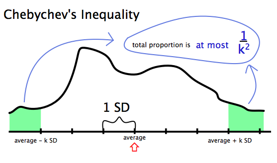



Chebychev's Inequality
**************************************************

Recall that standard deviation, :math:`s`, has the same units as the data from which it is calculated. [#]_

Now, comes something quirky. It took me a while comprehend this. 

*In statistics, it's common to use standard deviation as a* **unit of measurement.** That is, if I'm a 'normal' male height, say 5'10"[#]_, then a typical male basketball player in the range of 6'6" may be one or more standard deviations ('SDs') above average. How much is one SD? That depends on the data.

Curiously, no matter what the data, the vast majority of entries will be in the range of :math:`\text{mean}\pm \text{a few SDs.}` (:math:`\pm` reads "plus or minus", as in "a little above or a little below".) 

Put another way, the majority of your data will be centered about the average. Not necessarily exactly at the average, but within several standard deviations' range.

Pafnuty Lvovich Chebychev (1821-1894) made this precise, so we named the phenomena after him.  I'm not sure how to pronounce his first or middle names, but his family name is pronounced sort of like 'shebb-eh-sheff'.  

|chebychev|

.. |chebychev| image:: images/s02l05-chebyshev.jpg

|chebychev-graph|

Formal statement of Chebychev Inequality
=============================================

In any list, the proportion of entries that are :math:`k` or more SDs away from the average is at most :math:`\frac{1}{k^2}`.

For example, in any list of numbers, the proportion of entries that are 2 or more standard deviations ("SDs") away from the average is at most :math:`\frac{1}{4}`.

- **At most 25%** of the list is **outside** the interval :math:`\text{average}\pm2\times\text{SD}`.
- **At least 75%** of the list is **in** the interval :math:`\text{average}\pm2\times\text{SD}`.

What makes SD a good measure of spread?
=============================================

In any list, at most :math:`\frac{1}{9}` of the entries are 3 or more SDs away from average.

**At least** :math:`\frac{8}{9}` of the entries are **in** the range :math:`\text{average}\pm3\times\text{SD}`.

To be vague
~~~~~~~~~~~~~~~

To be a bit vague, no matter what the data, the vast majority of entries will be in the range of :math:`\text{average}\pm\text{a few SDs}`.

To be precise
~~~~~~~~~~~~~~~~~

To be a bit precise, no matter what the data, a proportion of at least :math:`1-\frac{1}{k^2}` of the entries will be in the range :math:`\text{average}\pm k\times\text{SD}`.

Chebychev and a bound on one tail
======================================

Chebychev says that the proportion **outside** the range :math:`\text{average}\pm k\times\text{SD}` is **at most** :math:`\frac{1}{k^2}`.

This is an upper bound on the total proportion in the two tails:

Left tail:

:math:`\le \text{average} - k \times \text{SD}`

Right tail:

:math:`\ge \text{average} + k \times \text{SD}`

So it is also an upper bound on each of the two tails separately:

* The proportion in the left tail is at most :math:`\frac{1}{k^2}`
* The proportion in the right tail is at most :math:`\frac{1}{k^2}`

But you **cannot say** that the proportion in one tail is at most **half** of :math:`\frac{1}{k^2}`, unless you know that the two tails are equal.

Example: Markov and Chebychev compared
=============================================

Now that we've learned that Markov's Inequality and Chebychev's Inequality are two ways of describing the bounds of a distribution, lets see how the two approaches are similar and where they are different.

Suppose we have a bunch of data on people's ages. We're told that the average, :math:`\overline{x}`, is 20 years and that the standard deviation, :math:`s`, is 5 years.

**What percent of the people in our dataset are more than 80 years old?**

Markov
~~~~~~~~~~~~~~~~~~~~~~~~~~~~~~~~~~

* Markov's bound: Age is non-negative; 80 is equal to 4 times the average.
* Markov's inequality: the proportion is at most :math:`\frac{1}{4}`, that is, **at most 25% are more than 80 years old.**

**Note that Markov does not use the standard deviation!**

Chebychev
~~~~~~~~~~~~~~

* Chebychev's bound: 80 years is 60 years above average. That is 12 SDs above average.
* Chebychev's inequality, applied to the right tail, shows that the proportion :math:`\ge \text{average} + 12 \times \text{SD}` is at most :math:`\frac{1}{144} = 0.7%`, roughly. Thus, Chebychev says that **at most 0.7% are more than 80 years old.**

The result of Markov versus Chebychev
~~~~~~~~~~~~~~~~~~~~~~~~~~~~~~~~~~~~~~~~~~

Both Markov's bound and Chebychev's bound are correct. However, Chebychev's bound is much sharper. This is due to Chebychev's bound relying on the SD, and not just the average. Markov's bound relies only on the average, making Markov's bound less precise.

----------------------------------------------------------------------------------------

.. [#] Versus variance, :math:`s^2`, which is the *square* units of the data from which it is calculated)

.. [#] Which I'm not, but work with me here.