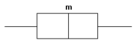



PSet 02
**********

This PSet is for you to practice. Some questions from PSets may appear again on ESets and Exams. To aid you in your learning of statistics, do not look at the correct solutions (bottom of page) until you have made an effort to solve each problem.

[#]_ Given the following boxplot where :math:`m` is the median value, what statement could be made about the distribution of the data?

|pset02graph01|

- The distribution is approximately symmetric.
- The distribution is positively skewed.
- The distribution is negatively skewed.
- The data are nominal and consequently can not be identified as symmetric or skewed.

[#]_ What is the median of the following set of values?

10, 8, 5, 3, 14

[#]_ What is the midrange of the following set?

    1, 7, 6, 8, 0, 8, 14, 14, 14

[#]_ The number of police officers in selected city districts is listed below. Find the mode.

    24, 26, 24, 30, 23, 28, 19, 31, 24, 26, 19

[#]_ A student received the following grades last semester. Find the student's semester grade point average.

=========== ======= ============
Course      Credits Grade/Points
=========== ======= ============
Statistics  4       A/4.0
Physics     5       A/4.0
Sociology   3       B/3.0
Literature  2       B/3.0
Tennis      1       D/1.0
=========== ======= ============

[#]_ The variance of a data set is the square root of the standard deviation. True or False?

[#]_ _______________ identifies a minimum percentage of the data points that fall within a certain distance of the mean, and it applies to any distribution regardless of its shape.

[#]_ Give that the variance for a data set is 1.20, what is the standard deviation?

[#]_ The average weight of an adult male bison in a particular federal wildlife preserve is 1650 pounds with :math:`\sf s=250` pounds. Find the weight of an adult bull whose z-score is -0.5.

[#]_ Given the following data set, find the approximate value that corresponds to the 75th percentile.

    10, 44, 15, 23, 14, 18, 72, 56

[#]_ Identify the five-number summary of the following data set. Except for calculating the median, use only values from the data set, with no synthesis of values.

    7, 11, 21, 28, 32, 33, 37, 43

|
|
|
|
|
|
|
|

Solutions
==============

.. [#] The distribution is approximately symmetric.
.. [#] The median of 10, 8, 5, 3, and 14 is 8.
.. [#] The midrange is 7.
.. [#] "Chebyshev's theorem"
.. [#] The mode is 24.
.. [#] The student's GPA is 3.80.
.. [#] False. The statement is backward. The standard deviaton is the square root of the variance.
.. [#] The standard deviation :math:`s` is equal to :math:`\sqrt{s^2} = \sqrt{1.20} = 1.10`.
.. [#] 1525 lb.
.. [#] 
    44. The list contains 8 elements. The 75th percentile is located at position :math:`\sf 0.75 \cdot 8 = 6`. When the list is arranged in ascending order, value 44 is in the 6th position.
.. [#] 
    Five-number summaries consist of the smallest value, lower quartile, median, upper quartile, and the highest value.

    - smallest value: 7
    - lower quartile: 11
    - median: 30
    - upper quartile: 33
    - highest value: 43

