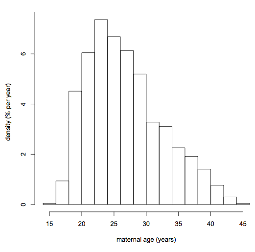
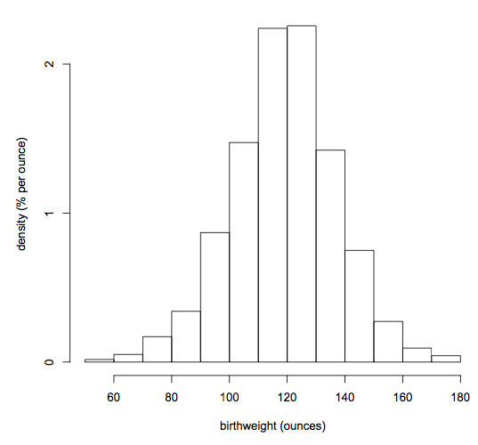
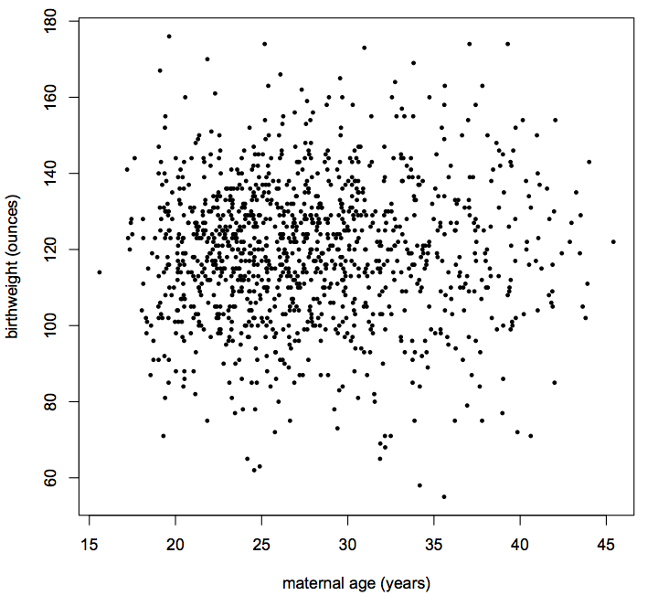
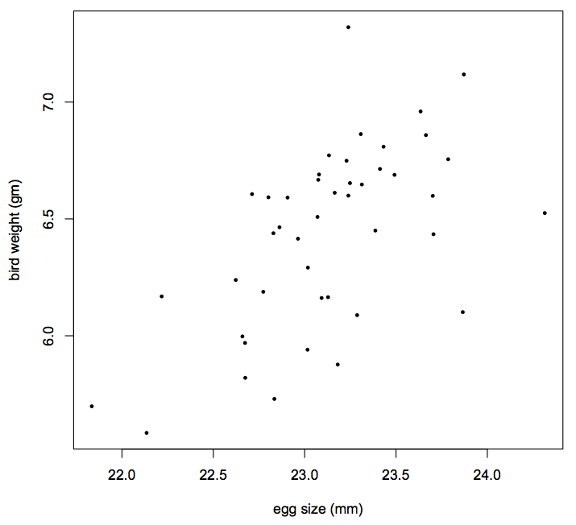
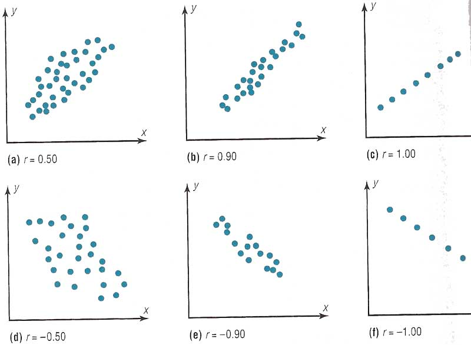



Correlation
**************************************************

Univariate vs bivariate vs multivariate
===========================================

Everyone's played pinball. You put $0.25 [#]_ into the machine to have the joy of using mechanical flippers to hit a steel ball into randomly placed bumpers and ramps, with the goal of scoring more points than anyone ever, even Tommy. [#]_ If you play your single ball well enough, you might unlock an extra ball. Now you have two balls ricocheting through the game board, perhaps doubling your chances of scoring points but also halving your attention per ball (but you have two eyes, right? You have to play chameleon-style). If you're *really* good, you'll unlock another ball or two, totalling four balls on the game board. It's a points-grabbing, noise-spewing, mayhem-making fun time in which the whole game board lights up.

Lets back up a moment.

1. When you were playing with 1 ball, you might say you're playing the pinball game in *monoball* mode.
#. When you are playing with 2 balls, you may be in *biball* mode.
#. When you're playing with 3+ balls, you're in *multiball* mode.

Statisticians use the same naming scheme when talking about the types of data they are studying.

Univariate 
~~~~~~~~~~~~~~

**Univariate statistics** is when you're describing a single variable at a time.

For example, you may measure the lengths of rock band members' mullets. Or something more potentially important, like the age a mother gives birth:

|maternal-age|

Or a baby's birthweight:

|baby-birthweight|

For univariate statistics, you may describe the data by these characteristics:

- shape, via frequency distribution
- center, via mean
- dispersion, via standard deviation

Bivariate and Multivariate
~~~~~~~~~~~~~~~~~~~~~~~~~~~~~

**Bivariate statistics** describe the relationship between two variables.

We also use the term **multivariate statistics**, which includes bivariate statistics, trivariate statistics, etc. 

Here is a scatter plot that relates the two histograms seen above. This plot shows maternal age and its relationship to baby birthweight.

|age-birthweight|

For multivariate statistics, including bi-,tri-, n-variate statistics, you may describe the data by these characteristics:

- shape, via scatter plot
- center, via correlation coefficient
- dispersion, via standard error of estimation

You haven't yet learned the tools to work with multivariate statistics, but you will.

The tools devised for multivariable statistics are basically all the same, whether you're working with bivariable data, trivariable data, etc. For simplicity, I'll use bivariate data in the examples and explanations.

Bivariate data, zooming in
~~~~~~~~~~~~~~~~~~~~~~~~~~~~~

Bivariate statistics tell us:

- Are two or more variables related?
- How strongly?
- What is the nature of the relationship?
- Can one variable be used to predict the other one?

**Correlation** and **regression** can help us to get answers.

A relationship between two variables is called a simple relationship. For this lecture, we're interested in a possible linear relation between two variables.

:math:`r`, the Correlation Coefficient
=========================================

The correlation coefficient :math:`r` measures the strength and direction of a *linear* (i.e., a straight line) relationship between two variables, usually labeled :math:`x` and :math:`y`.

:math:`r` and what it means
~~~~~~~~~~~~~~~~~~~~~~~~~~~~~~~~

:math:`r` may be equal to -1, 0, +1, or somewhere in between, but nowhere beyond. (So :math:`r` can't be -2, for example.) We can write this as

.. math:: 

	-1 \le r \le 1

So, what does the value of :math:`r` actually tell us?

- If :math:`r=0` there is no linear correlation.
- If :math:`r\gt0` there is a positive correlation, in which the data increases as you read the scatterplot from left to right.
- If :math:`r\lt0` there is a negative correlation, in which the data decreases as you read the scatterplot from left to right.
- If :math:`r=+1` or :math:`r=-1` there is a perfect positive or negative correlation, respectively, between :math:`x` and :math:`y`.

Below is a scatter plot showing a positive linear relationship between a egg size and the hatched bird's weight:

|bird-egg-weight|

Here are what scatterplots look like given six different :math:`r` values. Plots (a), (b), and (c) show positive correlations. Plots (d), (e), and (f) show negative correlations.

|correlationplots|

Computing :math:`r`
======================

:math:`r` isn't something you're going to want to calculate by hand very often. Python can calculate :math:`r`, as can Excel and other software packages.  

To calculate the correlation coeffficient between two sets of numers, you would perform the following steps, each of which is illustrated by use of the data on heights and weights for 15 hypothetical students in the table below.

1. Convert the height of each student to standard units: :math:`\frac{(\text{height} - \text{mean})}{\text{standard deviation}}`
#. Convert the weight of each student to standrd units: :math:`\frac{\text{weight} - \text{mean}}{\text{standard deviation}}`
#. Calculate the product for each student of :math:`\text{weight in standard units} \times \text{height in standard units}`. You should see that this numebr will be largest in absolute value when a student's height and weight are both relatively far from the mean.
#. The correlation coefficient is the sum of the products calculated above divided by the number of observations. (15 in this case.)

The correlation between heigh and weight for this group of students is 0.83. Given that the correlation coefficient can range from -1 to 1, this is a relatively high degree of positive correlation, as we would expect with height and weight.

To tickle your mathematical fancy, the forumal for calculating the correlation coefficient, :math:`r`, for two variables :math:`x` and :math:`y` is the following:

.. math::

	r = \frac{1}{n} \Sum\limits_{i=1}^n \frac{x_i-\overline{x}}{\sigma_x} \frac{y_i-\overline{y}}{\sigma_y}

where 

	:math:`n` = the number of observations
	:math:`\overline{x}` = the mean for variable :math:`x`
	:math:`\overline{y}` = the mean for variable :math:`y`
	:math:`\sigma_x` = the standard deviation for variable :math:`x`
	:math:`\sigma_y` = the standard deviation for variable :math:`y`

------------------------------------------------------------------------------------------------------------------------

.. [#] If you're lucky. Lots of pinball machines are $0.50 now. Stupid inflation...

.. [#] `The Pinball Wizard <http://en.wikipedia.org/wiki/The_Who%27s_Tommy>`_