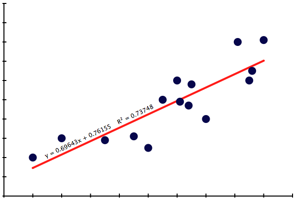



Regression
**************************************************

Recap on Correlation
======================

If you've ever used Netflix you've seen its recommendations of new films you'd like based on how highly you rated films you've seen. For example, if you gave five-star ratings to *Fog of War* and *Enron: The Smartest Guys in the Room*, Netflix's algorithm may suspect that you like documentaries, and would probably give a high rating to *Buhutto*, a film about the life and death of former Pakistani prime minister Benazir Bhutto.  

How does Netflix provide these recommendations? Does Netflix have a huge team of interns who use a combination of Google and personal interviews with your family and friends? Of course not. Instead, Netflix has mastered some advanced statistical techniques. By correlating your film preferences with those of other users who share similar tastes, Netflix can predict what films you may enjoy. While the Netflix algorithm is sophisticated [#]_, it's principles rely on the same stuff you're learning right now.

In the previous lecture you learned how to interpret correlation coefficient, :math:`r`, values, whether they are equal to -1, 0.5, or +1, for example.

In this lecture, you will learn how to determine a 'line of best fit' through football-shaped, bivariate data. The line of best fit is a *regression* or *least squares line*. Once we know the best fit line, we can *interpolate* between the data.

The idea of regression
===========================================

The regression [#]_, or least squares line, is the line (not *a* line, but *the* line) with the smallest *sum of squared errors*. That is, it's the only line that can be overlayed on a scatter plot so that the average distance each individual point is from that line is as short as possible.  

For example, here is a scatter plot:

|scatter-needs-fit|

You can try to 'eyeball' the regression of the scatter plot. Sarah plotted a line that she felt was the 'best fit', and Lee plotted the line that he felt was the 'best fit'. 

|looking-for-best-fit|

Notice that, because Sarah and Lee *qualitatively* eyeballed their lines, the two lines don't line up. (Sorry for writing 'line' so often.)

We can't tolerate such subjectivity -- everyone would disagree about which line is the bestest best fit line, and this leads to territory disputes, which lead to wars, which lead to unpleasant things. So we need to agree on an objective way to *quantitatively* decide the best fit line, like this:

|best-fit-line|

Like the correlation coefficient, :math:`r`, calculating the best fit line is not something you are going to calculate by hand very often. (After you've entered the data, Python or a software package like Excel will calculate what we need.)

Equation of the regression line
======================================

However a regression line is calculated, the end result is a **regression line equation**. Recall from algebra that the equation for a line is :math:`y = mx+b`, where :math:`y` is a location on the vertical axis, :math:`m` is the slope [#]_, :math:`x` is a location on the horizontal axis, and :math:`b` is where the line intercepts the vertical axis.

Statisticians borrow this equation for describing regression lines. However, they change it ever-so-slightly: :math:`y' = mx+b`, where :math:`y'` [#]_ is the predicted value, :math:`m` is the relationship between the two variables, :math:`x` is the independent variable, and :math:`b` is where the line intercepts the vertical axis.

|best-fit-line-eqn|

The regression line equation is written along the regression line itself. In this example, our regression line equation is :math:`y' = 0.69643x + 0.76155`. That is, the slope is :math:`m = 0.69643` and the y-intercept is :math:`b = +0.76155`.

Hmm, what's that :math:`R^2`? That's the **squared correlation**. It's just the square of the little :math:`r` from the previous lecture.  

.. math::

	r \times r = r^2 = R^2

We use a capital :math:`R^2` instead of just :math:`r^2` to help distinguish :math:`r`, the correlation coefficient, from :math:`R^2`, the squared correlation.

:math:`R^2` tells us one simple thing: how well the scattered data 'lines up' with the regression line.

Because :math:`R^2` is the square of :math:`r`, and because we know that :math:`-1\le r \le +1`, then :math:`R^2` must be a value between 0 and +1, denoted :math:`0 \le R^2 \le +1`. The closer :math:`R^2` is to +1, the 'tighter' the data is to the regression line. Instead, if :math:`R^2` is closer to 0, say 0.1, that indicates that the data is very weakly *correlated* around the regression line -- we were able to plot a best fit line, but the data is quite wonky and not cooperative.

Compare the scatter plots and the resulting :math:`R^2` values below:

|correlation-scattered|

:math:`R^2` is close to 0. Weak linear correlation.

|correlation-tight|

:math:`R^2 = 0.75923`, indicating good-to-strong linear correlation.

Interpolation
================

Notice how, in regression equations, :math:`y'` is called the *predicted value*? This is what makes a regression line so useful. We can make predictions about future data based on data we've alread collected. For example, lets say we did a study on diaper rashes, studying the number of rashes found per baby among babies who don't use baby powder. As part of our study we collected data on babies who, on the low end of the scale, never wore diapers (eww...) to, on the high end, wore diapers for 24 hours (all the time...).  Our independent variable is :math:`x` [#]_, which equals the number of hours a baby is in a diaper. Our dependent predicted variable is :math:`y'`, equaling the number of rashes on the baby.

Lets say we already gathered the data and calculated the equation for the regression line. The regression line is :math:`y' = 2x + 1`. If I let my kid [#]_ sit around in his diaper for :math:`x=2` hours, what is the likely number of rashes he will have? Since we're asking about a value of :math:`x` that is *within* the limits of our data (between 0 hours and 24 hours of diaper-wearing), we can interpolate based on the regression line.

Just substitute :math:`x=2` in the equation and see what the predicted value, :math:`y'`, equals.

.. math::

	\begin{split}
	y' &= 2x + 1 \\
	&=2(2) + 1 \\
	&=4 + 1 \\
	&=5
	\end{split}

So, based on the data we collected, I can predict if I make my  kid wear a diaper for two hours without baby powder, he'll have about 5 rashes. Poor guy! He'll seek revenge I'm sure...

|revenge-kid|

---------------------------------------------------------------------------------------------------------------------------------------

.. [#] It's described in a `ninety-two page technical document <http://netflixprize.com/assets/GrandPrize2009_BPC_PragmaticTheory.pdf>`_. The algorithm was devised by a seven-person team made up of statisticians and computer scientists from the United States, Austria, Canada, and Israel. This team won the $1,000,000 NetFlix Prize contest in 2009.

.. [#] The procedure is called *regression analysis* because, around the turn of the century (1900s), geneticist Francis Galton discovered a phenomenon called *regression toward the mean*. He sought laws of inheritance, and found that sons' heights tended to regress toward the mean height of the population, compared to their fathers' heights. Tall fathers tended to have somewhat shorter sors, and vice versa. Galton deeloped regression analysis to study this effect, which he referred to as "regression toward mediocrity". How pleasant.

.. [#] Recall that slope is equal to the change in :math:`y` over the change in :math:`x`, or the "rise over the run". This is usually written as :math:`\frac{\Delta y}{\Delta x}`, or just :math:`m`.  

.. [#] Pronounced "y prime". Note: we're not doing any calculus here, like taking derivatives.

.. [#] :math:`x` is *always* the independent variable. It's convention among statisticians.

.. [#] I don't have a kid.