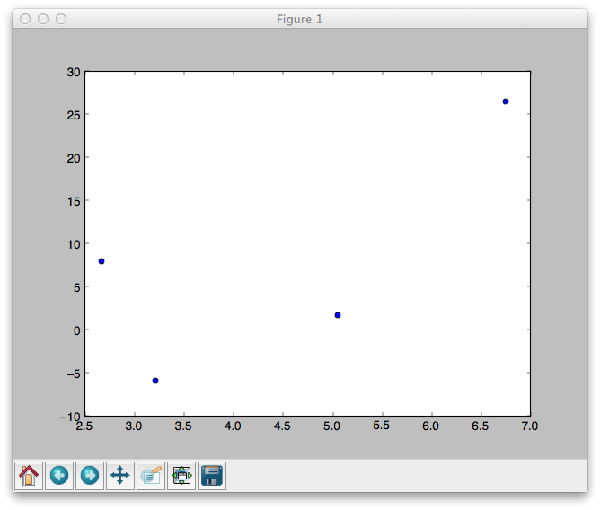



Lab 03
*************************************

First, work through these exercises:

- `Exercise 8: Making a Chart <http://www.jmillville.com/project/learnstats/ex8.html>`_
- `Exercise 9: Rowers and Coxswains <http://www.jmillville.com/project/learnstats/ex9.html>`_

Next, you will complete the exercises below. These will show you how to calculate and plot regression equations and the correlation coefficien, :math:`r`.

1. calculating the regression equation and correlation coefficient
#. making a scatter plot
#. making a scatter plot, including the regression line.
#. making a scatter plot w/ regression line and labels

There is nothing to turn in for this lab. 

Calculating the regression equation and :math:`r`
=======================================================

Create a new empty file in Canopy. Then type the following:

{{ ork.code('code/s03lab01-correlation-regression-calc.py|pyg') }}

Save the file as *lab03-correlation_regression.py* and run it.

Results
~~~~~~~~~~~~

You should see the following::

	{{ d['code/s03lab01-correlation-regression-calc.py|py']|indent(4) }}

First we import a module named "stats", which resides in another module named "scipy". The scipy and scipy.stats modules have a plethora of helpful pre-made tools that we can use. You can view some at the `scipy documentation site <http://docs.scipy.org/doc/scipy/reference/stats.html>`_. You are definitely *not* expected to understand most of the content on that site. It's pretty sophisticated stuff, used by big-name organizations like NASA and Google.

After importing the "stats" module, we type in our data. For this example, it's just imaginary data.

Since we have two sets of data (an ``x`` and a ``y``), this is a bivariate analysis. (Regarding how we called the data ``x`` and ``y`` -- we could have called them ``simon`` and ``garfunkle`` if we really wanted to! Python doesn't care. However, it's wise to use names that are easy to follow and make sense.)

The line

	``m, b, r, p, std_err = stats.linregress( x, y )``

does something very interesting that you haven't seen before. You sort of have to read the line right-to-left. [#]_ The result of ``stats.linregress( x, y )`` is a set of five values. (You wouldn't know this by just looking at it. You would normally have to `read the documentation <http://docs.scipy.org/doc/scipy/reference/generated/scipy.stats.linregress.html>`_ for ``scipy.stats.linregress()`` to know what to expect.)

Since the documentation states that ``linregress()`` will return five values in the order of *slope*, *intercept*, *r-value*, *p-value*, and *stderr* (the standard error of the estimate), we need to be prepared to receive all this data.

To collect the data spewed out by ``linregress()``, we line up five variables: ``m`` for slope, ``b`` for y-intercept, ``r`` for r-value, ``p`` for p-value, and ``std_err`` for stderr.  All we really care about right now is ``m``, ``b``, and ``r``, but we have to collect the other two values or else Python will get angry and throw a fit.

Making a scatter plot
========================

Create a new empty file in Canopy. Type this into it:

{{ ork.code('code/s03lab01-make-scatter.py|pyg') }}

Save the file as *lab03-make-scatter.py* and run it.

Results
~~~~~~~~~~

This graph should appear:

|make-scatter|

We first ``import pylab``, which is how we make graphs with Python. Then we put our bivariate data into two variables, arbitrarily named ``x`` and ``y``.

Then we use ``pylab.plot( x, y, 'bo' )`` to tell ``pylab`` to use our ``x`` and ``y`` data to ararnge a scatter plot.  The string ``'bo'`` is weird. It tells ``pylab`` to make the scatter dots *blue* (hence ``'b'``) and to make them *circular* dots (hence the circle-shaped ``'o'``). The people who designed ``pylab`` decided to make it so you can combine color and shape together as shorthand. You can play with the color and dot options. Try ``'yo'``, ``'k*'``, and ``'g^'`` for a taste. There's a table of all the combinations about halfway down on `this page. <http://bespokeblog.wordpress.com/2011/07/07/basic-data-plotting-with-matplotlib-part-2-lines-points-formatting/>`_ Pick one that is pleasing to your eye.

Making a scatter plot with regression line
==============================================

Type this code:

{{ ork.code('code/s03lab01-correlation-regression-plot.py|pyg') }}

Save the file as *lab03-scatter-regression.py* and run it.

Results
~~~~~~~~~~

This graph should appear:

|correlation-regression-plot|

With this script, we've combined the previous two into one. We ask Python to load up the ``stats`` module that resides within ``scipy``, and to then load up the ``pylab`` module.

Next, our imaginary data is organized into a pair of lists and saved as two separate variables, ``x`` and ``y``. We don't combine the lists because we are presumably analyzing *bivariate data* -- that is, the list known as ``x`` contains values associated with the *independent variable*, while the list known as ``y`` contains values associated with the *dependent variable*. In other words, we can't mix the two lists or our analysis is ruined.

After typing in the data, we tell Python to take our two lists, ``x`` and ``y``, and send them to the ``linregress()`` function, which is contained within the ``stats`` module we loaded earlier.  

With our slope, intercept, and :math:`r` value calculated, it's time to do some boilerplate code to 'massage' the data into the right format for plotting.  ``fit = pylab.polyfit( x, y, 1 )`` accepts our ``x`` and ``y`` data and fits a 1-degree polynomial to the data. A 1-degree polynomial happens to be a line!  We take the result of the function, ``fit``, and send ``fit`` to a new function: ``pylab.poly1d( fit )``.  You don't have to understand why we have to perform this little jig. But if you're curious, search online for "pylab.polyfit" and "pylab.poly1d". Otherwise, just accept that you have to do these lines of code to get a regression line plotted.

Having performed all the needed calculations and even massaged a Python, we end by telling ``pylab`` to combine everything into a scatter plot.  

Once Python combines everything, then we have to instruct it to display the chart on the screen, via the command ``pylab.show()``.

Making a scatter plot with regression line and labels
=======================================================

Type this code:

{{ ork.code('code/s03lab01-correlation-regression-plot-labels.py|pyg') }}

Save the file as *lab03-scatter-regression-labels.py* and run it.

Results
~~~~~~~~~~

This graph should appear:

|correlation-regression-plot-labels|

This graph differs only by the presence of two labels that detail the regression line's equation and correlation amount, :math:`R^2`.  

To add a label, we first have to create a string (a sentence in quotes). Our first string gives the equation for the regression line, in the form :math:`y' = m x + b`. This line constucts that string: ``equation = "y' = %.3f * x + %.3f" % (m, b)``. This looks kind of complex. The ``%.3f`` is just a *placeholder*, telling Python to "hold this spot for a decimal value (a *floating point* value) and make it have 3 spaces after the decimal point."  Note that there are two placeholders in this string, because we want to include two decimal values, ``m`` and ``b``.  I recommend you fiddle with this line to see how it breaks, to see if you can change the number of decimal points that are included (try ``%.2f`` and ``%.4f``), and other tweaks.

Once we have constructed a string (again, a *sentence*, the stuff in quotes in the code), we tell ``pylab`` to add the text to the image, via the command ``pylab.figtext( 0.5, 0.4, equation )``.  The ``0.5`` and ``0.4`` are horizontal and vertical coordinates, respectively, to place the text. Note that ``pylab`` assumes that ``0.0`` and ``0.0`` is the bottom left corner of the plot, and ``1.0`` and ``1.0`` is the top right corner of the plot.  These numbers have nothing to do with the x-axis and y-axis scales that are set up for our bivariate data.  Play a bit with the label placement coordinates. See if you can make one label appear in the bottom right of the plot, and the other in the top left. See, I'm making this really fun for you.

So, our data shows a goodness of fit, :math:`R^2`, of 0.525. Are the data points a strong, medium, or weak fit to the regression line?

------------------------------------------------------------------------------------------------------------------------

.. [#] Reading lines right-to-left is common in computer programming. It doesn't make any sense at first, but then you start to get the hang of it.

