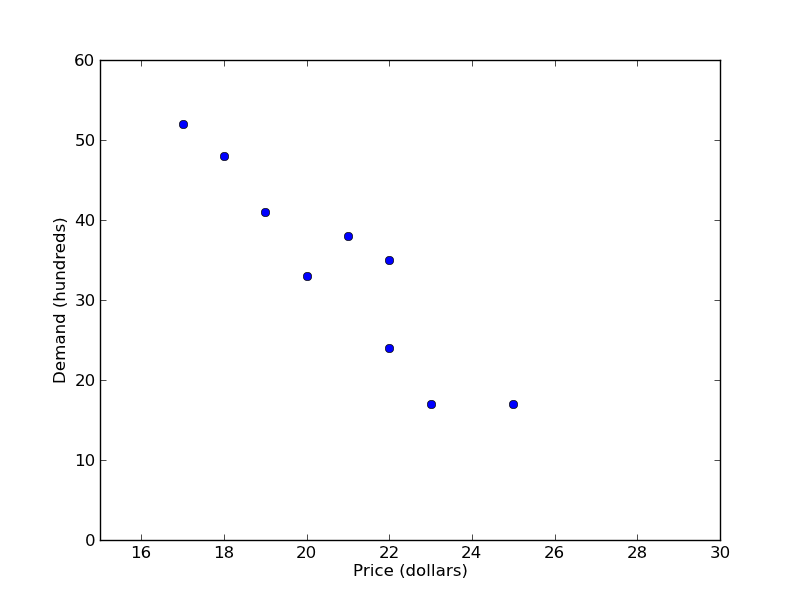
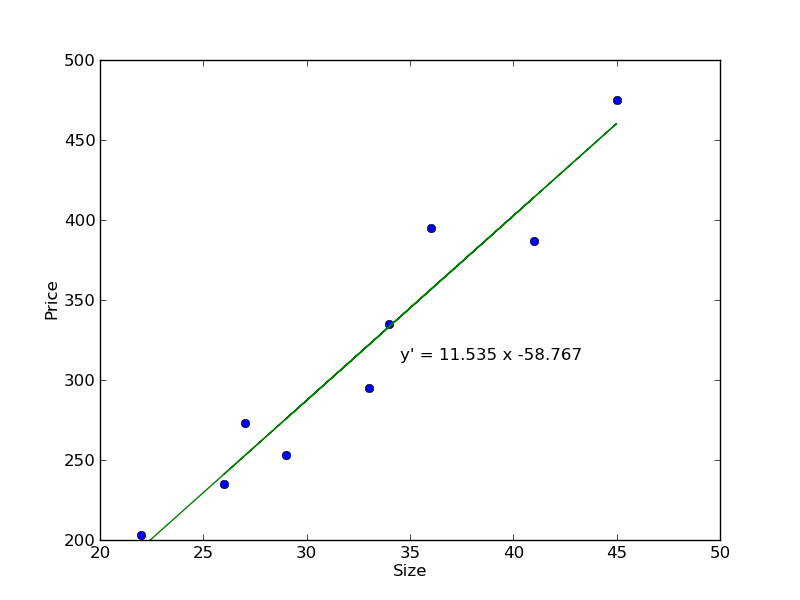



PSet 03
**********

This PSet is for you to practice. Some questions from PSets may appear again on ESets and Exams. To aid you in your learning of statistics, do not look at the correct solutions (bottom of page) until you have made an effort to solve each problem.

[#]_ The two variables in a scatter plot are called the

- independent variable and dependent variable.
- relative frequency and relative proportion.
- spread and pattern.
- lines and points.

[#]_ The range of the correlation coefficient is from 0 to 1. Is this correct?

[#]_ Compute the correlation coefficient of this data: 

== ===
x  y
== ===
60 138
43 119
56 134
46 128
57 132
== ===

`Consider using Python for this calculation. <s03lab.html>`_  Written in Python, the above table would look like this:

{{ ork.code('code/s03pset-xydata.py|pyg') }}

[#]_ A study was conducted to determine if there was a relationship between the prices a non-member of a book club paid for various publications and the prices that a member paid for the same publications. The data gathered is shown below. Compute the correlation.

=================   =============
Non-member price    Member price
=================   =============
58                  32
42                  22
46                  20
32                  16
25                  19
75                  58
35                  34
63                  48
=================   =============

[#]_ When :math:`r` is not significantly different from 0, the best predictor of :math:`y` is the ________ of the data values of :math:`y`.

[#]_ If the equation for the regression line is :math:`y'=-4x+3`, then the slope of this line is _____.

[#]_ Regression is a statistical method used to describe the nature of the relationship between variables. Is this true?

[#]_ What is the intercept of the regression line :math:`y'=4.6+3.2x`? 

[#]_ Find the equation of the regression line fitting this data:

== ===
x  y
== ===
52 308
60 338
54 308
53 298
55 298
56 308
== ===

I recommend using Python and it's ``stats.linregress()`` function, as seen in `this week's lab. <s03lab.html>`_

[#]_ Draw a scatter plot for the following data that show the demand for a product (in hundreds) and its price (in dollars) charged in nine different cities.

======  =======
Price   Demand
======  =======
23      17
18      48
19      41
21      38
20      33
25      17
22      35
17      52
22      24
======  =======

[#]_ A realtor wanted to determine if there was a relationship between the size (in 100 square feet) of a new custom-built home and the price (in thousands of dollars) of the home. Determine the regression line equation and then create a scatter plot with a regression line.

===============     ================
Size, :math:`x`     Price, :math:`y`
===============     ================
26                  235
27                  273
41                  387
29                  253
33                  295
34                  335
36                  395
45                  475
22                  203
===============     ================

|
|
|
|
|
|
|
|

Solutions
==============

.. [#] Scatter plots have two variables, the first, the independent variable, runs along the x-axis (horizontal). The second, the dependent variable, runs up the y-axis (vertical).
.. [#] Incorrect. The correlation coefficient, :math:`r`, has the range :math:`-1\leq r \leq +1`.
.. [#] :math:`r=0.933`. You can use Python to calculate :math:`r`. Your script may look like this:

    {{ ork.code('code/s03pset-correlation.py|pyg') }}

.. [#] :math:`r=0.857`, which is a strong positive correlation. Sample Python script:

    {{ ork.code('code/s03pset-correlation-memberprice.py|pyg') }}

.. [#] The mean is the best predictor in this case.
.. [#] The slope, :math:`m`, is :math:`-4`.
.. [#] Yes, regression describes the nature of relationships between variables.
.. [#] The intercept, sometimes called the *y-intercept*, is 4.6.
.. [#] The equation is :math:`y'=4.250x+75.917`. In Python: 

    {{ ork.code('code/s03pset-regressionequation.py|pyg') }}
.. [#] Your graph may look like below, and the code used to generate this graph is also below.

|scatter-pricedemand|

    {{ ork.code('code/s03pset-scatter-pricedemand.py|pyg') }}

.. [#] The regression equation is :math:`y'=11.535x-58.767`. Your graph may look like below, and the code used to generate this graph is also below.

|scatterregress-sizeprice|

    {{ ork.code('code/s03pset-scatterregress-sizeprice.py|pyg') }}