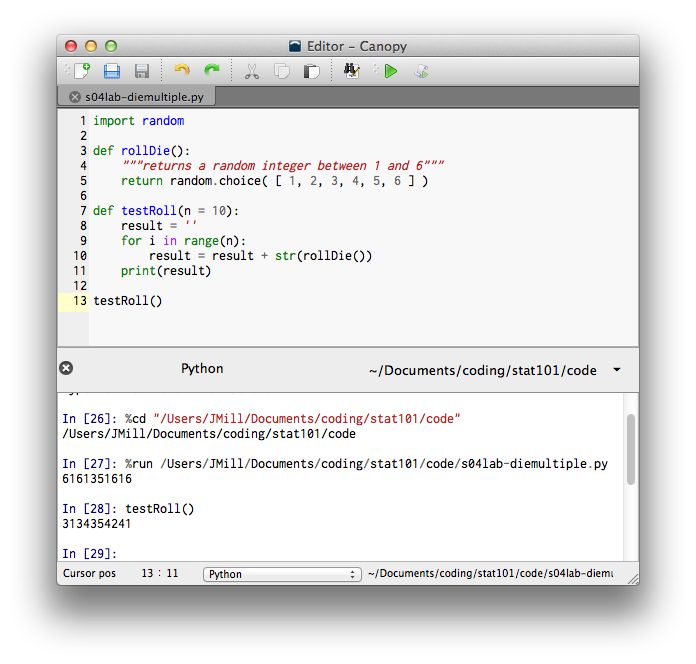



Lab 04-1
*************************************

1. the ``random`` module (``random.choice()`` and ``random.random()``), console.
#. rolling a die
#. rolling a die multiple times

Rolling a Die
=======================================================

Create a new empty file in Canopy. Then type the following:

{{ ork.code('code/s04lab-die.py|pyg') }}

Save the file as *lab04-die_simulation.py* and run it.

Results
~~~~~~~~~~~~

Python's console should display a single number, such as 1 or 3 or 4, like this::

	{{ d['code/s04lab-die.py|py']|indent(4) }}

For fun, run the program multiple times. The number displayed will change five of every six times, on average. (Think about why this is so.)

Stepping through the code
~~~~~~~~~~~~~~~~~~~~~~~~~~~~

The code we typed above starts by first importing Python's built-in ``random`` module, which contains lots of tools for choosing things randomly.

Then, we create a new function, named "rollDie()", with the line ``def rollDie():``.  The line in triple double quotes, ``"""returns a random integer between 1 and 6"""``, is a comment that tells us (as the programmer) what our function is **supposed** to do.

With the line ``return random.choice( [ 1, 2, 3, 4, 5, 6 ] )``, we tell Python to pick one number out of a list of 1 through 6, and give that number to anyone (or anything) who mentions the function, ``rollDie()``.

When we type ``print rollDie()``, we tell the computer to run the ``rollDie()`` function once and to display the result on the screen. Since we coded the ``rollDie()`` function to return a number between 1 and 6, a number is displayed on the screen.

Rolling a die multiple times
==============================

Revise your program (*lab04-die_simulation.py*) to look like this:

{{ ork.code('code/s04lab-diemultiple.py|pyg') }}

Save it and run it.

Results
~~~~~~~~~~~

Our script now generates a sequence of 10 digits::

	{{ d['code/s04lab-diemultiple.py|py']|indent(4) }}

With the click of a mouse, you're now rolling a digital die 10 times. I know you think this is cool, but it gets way cooler.

Go to the console
~~~~~~~~~~~~~~~~~~~

Python's "Console" is located at the bottom of the "Editor - Canopy" window, as seen in the lower section of this image:

|editor-script|

Click in the console. Type ``testRoll()``.  You should see something like this:

|editor-run|

How would you roll the die 5 times?  Try typing ``testRoll(5)`` in the next line in the console:

|editor-testRoll5|

How would you simulate rolling a die 100 times?

Think about this
~~~~~~~~~~~~~~~~~~

Run ``testRoll()`` a couple more times. Would you be more surprised to see it print 1111111111 or 9682756354? Or, put another way, which of these two sequences is more random? Sorry, but this is a trick question. Each sequence is equally likely because the value of each roll is independent of the values of earlier rolls. When you roll a real-life die and get a 1, there's no internal mechanism in the die to prevent it from rolling a 1 on the next roll, or the roll after that, and so on. Each roll of a die is **independent** -- the outcome of one event has no influence on the outcome of the other.

This is a bit easier to comprehend if we simplify the situation. Think of a two-sided die (also known as a coin) with the values 0 and 1. The output of this die is a binary number, 0 or 1.  When we use a binary die, there are :math:`2^{10}` possible sequences that ``testRoll()`` may return. Each is equally likely. Thus, each has a probability of occurring of :math:`\left( \frac{1}{2} \right) ^{10}`.

Return to our normal six-sided die. How many different sequences are there of length 10? There are :math:`6^10` sequences.  Therefore, the probability of rolling ten consecutive 1`s (1111111111) is :math:`\left( \frac{1}{6} \right) ^{10}`. This is less than one in 60,000,000.  While this is a low probability, it's no lower than the probability of any other specific sequence of ten rolls, such as 9898471613.

Now think about it a different way
~~~~~~~~~~~~~~~~~~~~~~~~~~~~~~~~~~~~

Rather than determining the probability of rolling the die ten times and getting all 1's, we may be interested in the probability of rolling the die ten times and not getting a single 1. We can approach this scenario by phrasing it as how many of the :math:`6^{10}` possible sequences don't contain a 1.
