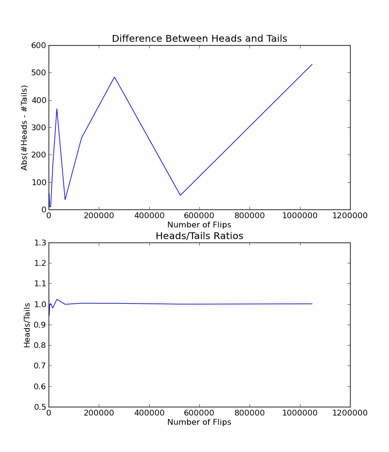



Lab 04-2
*************************************

Running an Experiment
======================

The program you wrote above, which has the ``testRoll()`` method, is a *simulation model*. Instead of forcing someone to roll a die multiple times, we wrote a script to simulate the activity.

Simulations are often used to estimate the value of an unknown quantity by making use of the principles of *inferential statistics*, which we'll be covering later in the course. In brief, the guiding principle of inferential statistics is that a random sample tends to exhibit the same properties as the population from which it is drawn.

Suppose Harvey Dent (a.k.a. Batman's nemesis Two-Face) flipped a coin, and it came up heads. You would not infer from this that the next flip would also come up heads. Suppose he flipped it twice, and it came up heads both times. You might reason that the probability of this happening for a fair coin (i.e., a coin where heads and tails are equally likely) was 0.25, so there was still no reason to assume the next flip would be heads. Suppose, however, 100 out of 100 flips came up heads. :math:`\frac{1}{2}^{100}` is a pretty small number, so you might feel safe in inferring that the coin has a head on both sides.

Your belief in whether the coin is fair is based on the intuition that the behavior of a sample of 100 flips is similar to the behavior of the populaiton of all flips of your coin. This belief seems pretty sound when all 100 flips are heads. Suppose that 55 flips came up heads and 45 came up tails. Would you feel comfortable in predicting that the next 100 flips would have the same ratio of heads to tails? For that matter, how comfortable would you feel about even predicting that there would be more heads than tails in the next 100 flips? Take a few minutes to think about this, and then try the experiment using the code below.

{{ ork.code('code/s04lab-flipsim.py|pyg') }}

Save the script as ``lab04-flipsim.py`` and run it. Nothing will appear in Python's console, as our program doesn't output anything until we instruct it to do so.

What the code does
~~~~~~~~~~~~~~~~~~~~~~

In the script above, the function ``flip()`` simulates the flipping of a fair coin ``numFlips`` times, and returns the fraction of flips that came up heads. For each flip, ``random.random()`` returns a random floating point (decimal) number between ``0.0`` and ``1.0``. Numbers less than or greater than ``0.5`` are treated as heads or tails respectively. The value ``0.5`` is arbitrarily assigned the value tails. Given the vast number of floating point values between ``0.0`` and ``1.0``, it is highly unlkely that this will affect the result. The function ``flipSim()`` uses ``flip()`` to run ``numTrials`` of ``numFlipsPerTrial`` flips, and aggregates the results.

In the console
~~~~~~~~~~~~~~~~

Try executing the function ``flipSim(100, 1)`` several times in the console.

I got this the first couple times I tried. You should see something similar, but not exact.

.. code-block:: python

    >>> flipSim( 100, 1 )
    0.47
    >>> flipSim( 100, 1 )
    0.55

It's insufficient to assume too much from performing a single trial of 100 flips. We typically structure our simulations to include multiple trials and then average the results. Lets perform 10,000 flips per trial, and perform 10 trials:

.. code-block:: python

	>>> flipSim( 100000, 10 )
    0.49973899999999993
    >>> flipSim( 100000, 10 )
    0.499383

Now we're seeing really good numbers. (We know that the answer should be 0.5.)  We can safely conclude something about the next flip, that heads and tails are about equally likely. We can conclude this because of the *law of large numbers*, also known as *Bernoulli's law*. This law states that in repeated independent tests (flips, in our case) with the same actual probability :math:`p` of a particular outcome in each test (e.g., an actual probability of 0.5 of getting a head for each flip), the chance that the fraction of times that outcome occurs differs from :math:`p` converges to zero as the number of trials goes to infinity.

It's important to note that the law of large numbers does not imply, as too many seem to think, that if deviations from expected behaviour occur, these deviations are likely to be evened out by opposite deviations in the future. This misapplication of the principle of regression to the mean is know as the *gambler's fallacy*. [#]_

It is also worth noting that "large" is a relative concept. For example, if we were to flip a fair coin on the order of :math:`10^{1,000,000}` times, we should expect to encounter several sequences of at least a million consecutive heads. If we looked only at the subset of flips containing these heads, we would inevitably jump to the incorrect conclusion about the fairness of the coin. In fact, if every subsequence of a large sequence of events appears to be random, it is highly likely that the sequence itself is not truly random. If your iTunes shuffle mode doesn't play the same song first once in a while, you can assume that the shuffle is not really random.

Finally, note that in the case of coin flips the law of large numbers doesn't imply that the absolue difference between the number of heads and the number of tails drops as the number of flips increases. In fact, we can expect that number to increase. What decreases is the ratio of the absolute difference to the number of flips.

Plotting the results of coin flips
------------------------------------

The code below contains a function that produces some plots intended to show the law of large numbers at work. The line ``random.seed(0)`` near the bottom ensures that the pseudo-random number generator used by ``random.random()`` will generate the same sequence of random numbers each time this code is executed. This is convenient for debugging.

{{ ork.code('code/s04lab-plotting-coin-flips.py|pyg') }}

Interpreting the plots
~~~~~~~~~~~~~~~~~~~~~~~~~~~

The call ``flipPlot(4, 20)`` produces the two plots:

|twoflipplots|

The plot on the top seems to suggest that the absolute difference between the number of heads and the number of tails fluctuates in the beginning, crashes downward, and then moves rapidly upward. However, we need to keep in mind that we have only two data points  to the right of :math:`x = 300,000`. That ``pylab.plot()`` connected these points with lines may mislead us into seeing trends when all we have are isolated points.  This is not an uncommon phenomenon, so one should always ask how many points a plot actually contains before jumping to any conclusion about what it means.

It's hard to see much of anything in the plot on the right, which is mostly a flat line. This too is deceptive. Even though there are sixteen data points, most of them are crowded into a small amount of real estate on the left side of the plot, so that the detail is impossible to see. This occurs because values on the x-axis range from 16 to 1,048,576, and unless otherwise instructed, pylab will space these points evenly along the axis. This is called *linear scaling*.  It's possible to adjust these visualizations using a *logarithmic scale*, though we will not worry about doing this yet. Just focus on the concepts of probability and simulation.

-----

.. [#] "On August 18, 1913, at the casino in Monte Carlo, black came up a record twenty-six times in succession [in roulette]. ... [There] was a near-panicky rush to bet on red, beginning about the time black had come up a phenomenal fifteen times. In application of the maturity [of the chances] doctrine, players doubled and tripled their stakes, this doctrine leading them to believe after black came up the twentieth time that there was not a chance in a mililon of another repeat. In the end the unusual run enriched the Casino by some millions of francs." Huff and Geis, *How to Take a Chance*, pp. 28-29. 
