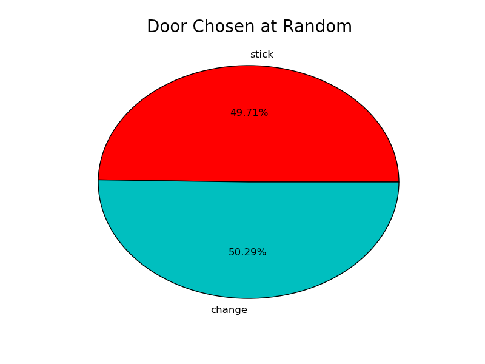
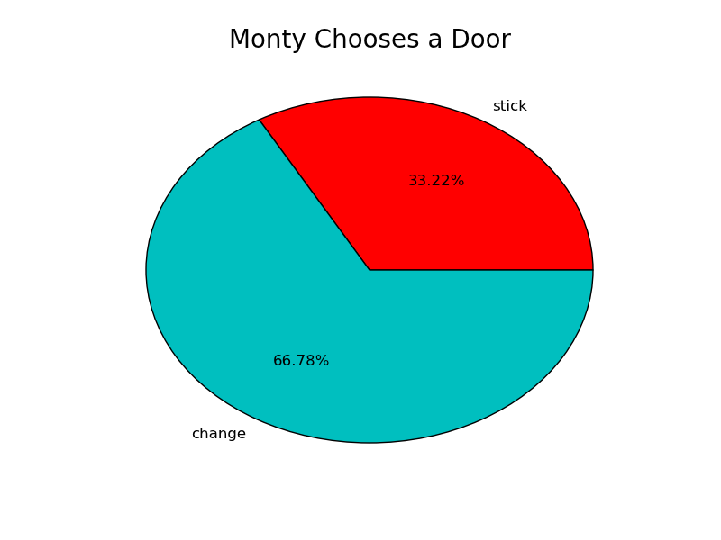



Lab 05-2 - The Monty Hall Show
*************************************

Remember Monty?
===============================

We learned how to calculate the probabilities associated with the Monty Hall Show. Recall that, after choosing one of three doors randomly and upon Monty opening one door to reveal a goat, classic probability tells us (unintuitively) that it's better to SWITCH our choice rather than STAY, because we are :math:`\frac{2}{3}` more likely to win a car by using a switching strategy. 

In this segment of the lab, we will conduct a Monte Carlo experiment to verify that the :math:`\frac{2}{3}` ratio holds approximately true.

Constructing a Monte Carlo Monty Hall simulator
=======================================================

Type the following code, saving as ``lab05-montyhall.py`` 

{{ ork.code('code/s05lab-montyhall.py|pyg') }}

Run the code.

Pie Charts
~~~~~~~~~~~~~~

Two pie graphs will appear, one at a time. The first shows the computed probabilities for when the computer, as a contestant on the game show, chooses doors randomly, without Monty offering to open a door to reveal a goat.

|montyrandom|

The second pie graph reveals the probabilities for when the computer again chooses randomly, but after Monty opens a door to reveal a goat.

|montyswitch|

Monty's act of opening a door he *knows* to contain a goat changes the odds in our favor if we choose a switching strategy. We've demonstrated this phenomenon via classical probability, determining the probability to be exactly :math:`\frac{2}{3}`, and we've demonstrated it via Monte Carlo simulation, calculating a probability of approximately 66.667\% (the decimal equivalent of :math:`\frac{2}{3}`).  

Carefully review the code and be sure you understand what each line does. Let me know if there's something you don't understand.