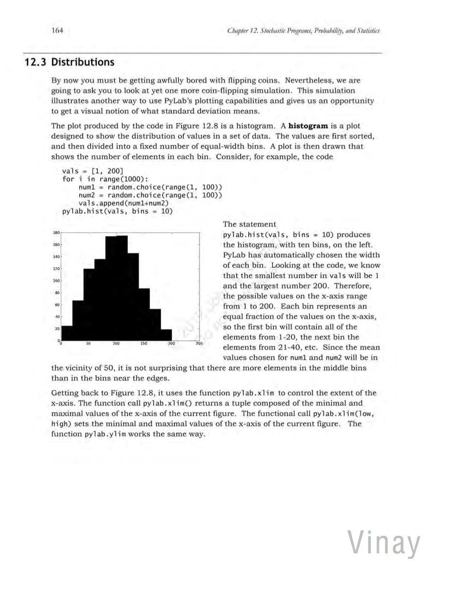
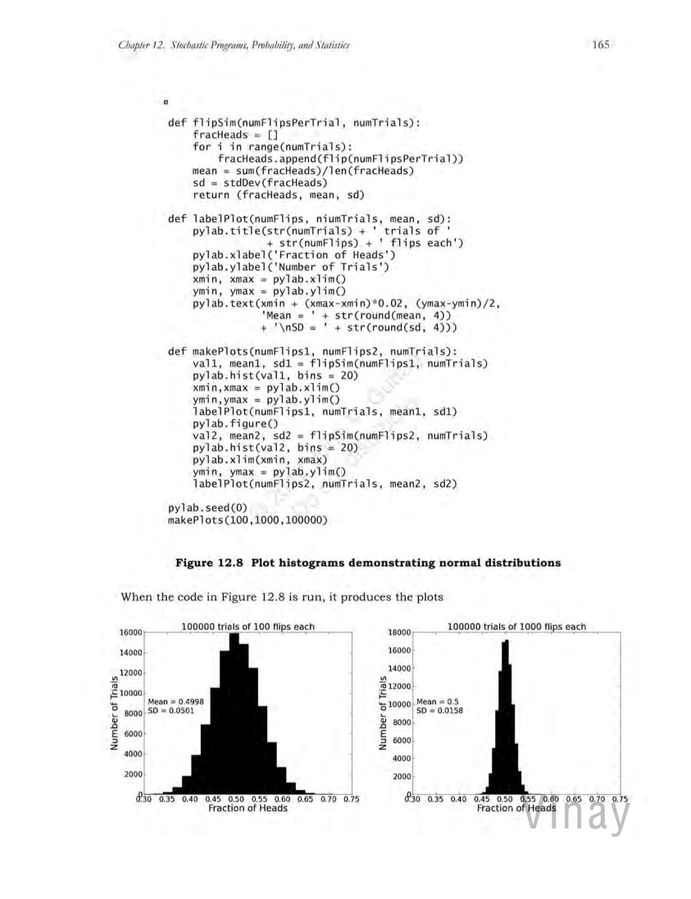
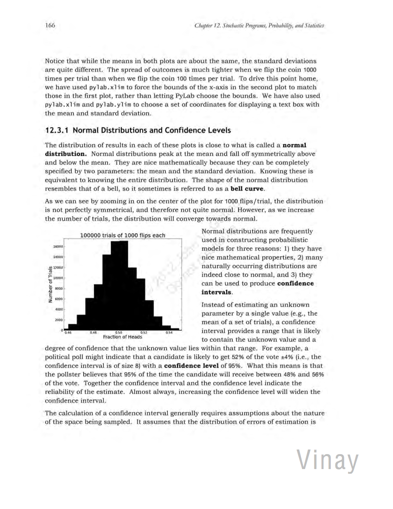
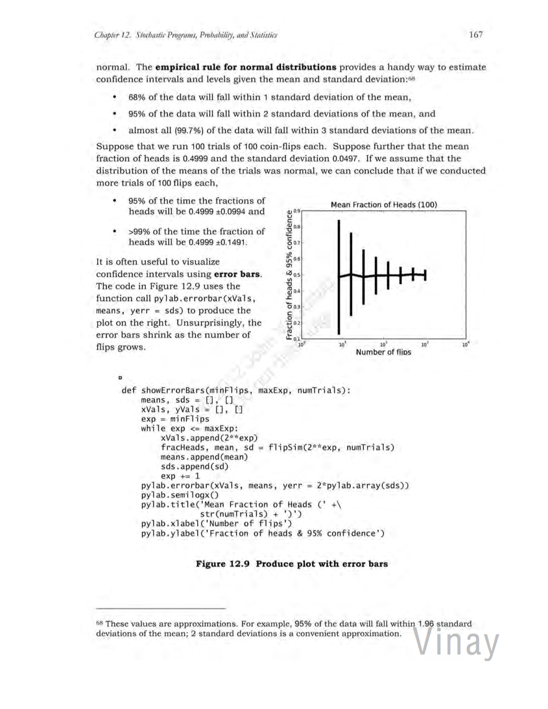
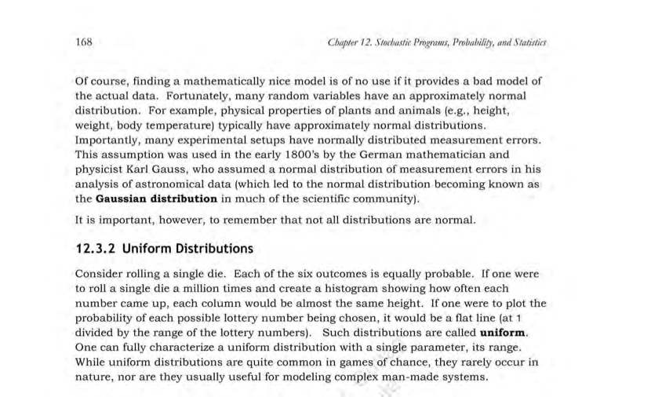



Distributions
**************************************************

We have a guest lab author this week. This is an excerpt from Chapter 12 of the introductory Python text by Vinay. Type in the code samples as in previous labs. 

.. NOTE:: You must include the line ``import pylab`` at the top your code. It's not explicitly shown in the code provided below. Let me know if you have trouble getting the code to run.

|s07lab-01|
|s07lab-02|
|s07lab-03|
|s07lab-04|
|s07lab-05|

This is the final page.

