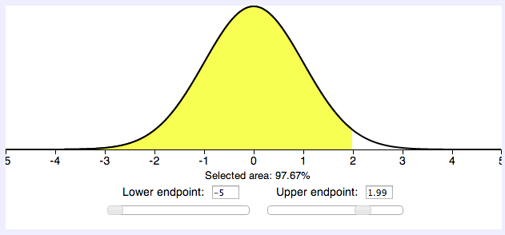
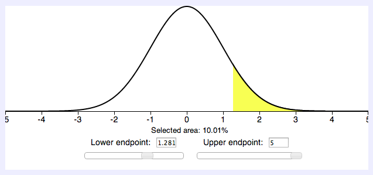
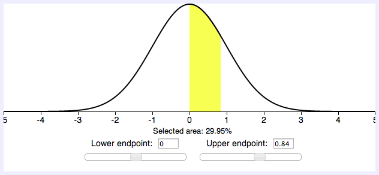
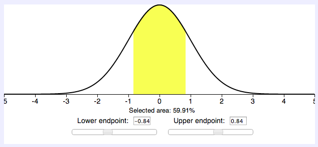
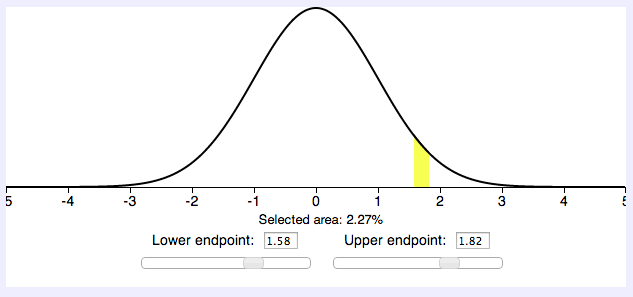



PSet 06
**********

Use SticiGui's `Area Under the Normal Curve tool <http://www.stat.berkeley.edu/~stark/Java/Html/NormHiLite.htm>`_

In addition to the examples from SticiGui Chapter 23, work through the following practice problems.

[#]_ Find the area to the left of z = 1.99

.. Elem Stats. page 320

[#]_ To qualify for a police academy, candidates must score in the top 10% on a general abilities test. The test has a mean of 200 and a standard deviation of 20. Find the lowest possible score to qualify. Assume the test scores are normally distributed.

.. Elem Stats. page 321

[#]_ For a medical study, a researcher wishes to select people in the middle 60% of the population based on blood pressure. If the mean systolic blood pressure is 120 and the standard deviation is 8, find the upper and lower readings that would qualify people to participate in the study.

[#]_ A survey of 18 high-technology firms showed the number of days' inventory they had on hand. Determine if the data are approximately normally distributed. Here is the survey data:

``data = [5, 29, 34, 44, 45, 63, 68, 74, 74, 81, 88, 91, 97, 98, 113, 118, 151, 158]``

To determine normality, use the Pearson coefficient of skewness, "PC" (also known as Pearson's index of skewness). A distribution is approximately normal, and not too skewed, if the result of the formula below is between or equal to -1 and +1.  The formula is:

.. math::
    \text{PC} = \frac{3\left( \overline{X} - median \right)}{s}

[#]_ A magazine reported that 6% of American drivers read the newspaper while driving. If 300 drivers are selected at random, find the probability that exactly 25 say they read the newspaper while driving. (Hint: This involves the normal approximation to the binomial distribution.)

-------

|
|
|
|
|
|
|
|
|

.. [#] 0.9767 = 97.67%

|left-of-1.99|

 

.. [#] A score of 226 should be used as a cutoff. Anybody scoring 226 or higher qualifies.  

Worked solution:

First, determine the :math:`z` score corresponding to the upper 10%:

|policeexample|

Substitute in the formula :math:`z = \frac{x - \mu}{\sigma}` and solve for :math:`X`.

.. math::
    \begin{split}
    1.281 &= \frac{X - 200}{20} \\
    1.281 \dot 20 + 200 &= X \\
    25.62 + 200 &= X \\
    226.62 &= X \\
    226 &= X
    \end{split}

.. [#] The middle 60% will have blood pressure readings of :math:`113.28 < X < 126.72`.

Worked solution:

Assume that blood pressure readings are normally distributed. To find the middle 60%, first find the right-half 30% (or the left-half 30% -- doesn't matter):

|bloodpressure-right|

The right-half 30% goes from :math:`z = 0` to :math:`z = 0.84`. Thus, the left-half 30% goes from :math:`z = -0.84` to :math:`z = 0`. Putting the two regions together to form the middle 60%, we see that :math:`z = -0.84` is the left (lower) bound and :math:`z = +0.84` is the right (upper) bound.

|bloodpressure-total|

Substitute into the formula :math:`X = z\sigma + \mu` to get

.. math::
    X_{\text{lower}} = (-0.84)(8) + 120 = 113.28

and

.. math::
    X_{\text{upper}} = (0.84)(8) + 120 = 126.72

.. [#] Yes, the distribution is approximately normal.  

For the survey data, :math:`\overline{X} = 79.5`, :math:`\text{median} = 77.5`, and :math:`s = 40.5`. Using the Pearson coefficient of skewness gives 

.. math::
    \begin{split}
    \text{PC} &= \frac{3 \left(79.5 - 77.5\right)}{40.5} \\
    &= 0.148
    \end{split}

Since :math:`-1 \le 0.148 \le +1`, the distribution is not significantly skewed.

.. [#] The probability that exactly 25 people read the newspaper while driving is 0.0227, or 2.27%.

Worked solution:

For this problem, :math:`p = 0.06`, :math:`q = 0.94`, and :math:`n=300`. 

First, determine whether a normal approximation can be used.

:math:`np = 300 \dot 0.06 = 18` and :math:`300 \dot 0.94 = 282`

Since :math:`np \ge 5` and :math:`nq \ge 5`, the normal distribution can be used.

Next step is to find the mean and standard deviation.

:math:`\mu = np = 300 \dot 0.06 = 18` and :math:`\sigma = \sqrt{npq} = \sqrt{300 \dot 0.06 \dot 0.94} = \sqrt{16.92} = 4.11`

Next step is to write the problem in probability notation: :math:`P(X = 25)`, and then rewrite using the continuity correction factor. Use an approximation of 0.5. Rewrite as :math:`P(25 - 0.5 < X < 25 + 0.5) = P(24.5 < X < 25.5)`. 

Find the corresponding :math:`z` values. Since 25 represests any value between 24.5 and 25.5, find both :math:`z` values.

:math:`z_1 = \frac{25.5-18}{4.11} = 1.82` and :math:`z_2 = \frac{24.5-18}{4.11} = 1.58`

Finally, we have to determine the corresponding area under a normal distribution curve. Using the `Area Under the Normal Curve tool <http://www.stat.berkeley.edu/~stark/Java/Html/NormHiLite.htm>`_:

|magazine-curve|

The area between the lower endpoint 1.58 and upper endpoint 1.82 is 0.0227, or 2.27%.
