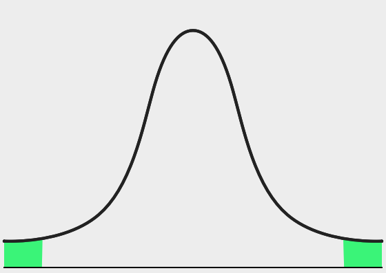



Alpha and Critical Points
**************************************

As we learn about the hypothesis testing, we come across :math:`\alpha` values, which is a measurement of certainty. If :math:`\alpha = 0.01`, our test aims for 99% confidence in the result. If :math:`\alpha = 0.05`, we are aiming for 95% confidence, and so on. :math:`\alpha` values are associated with critical points, an important part of hypothesis testing to determine when to reject/accept a null hypothesis.

:math:`\alpha` values and critical points are based on the normal distribution. You've found them in previous sections, though may not have realized it.

Left-tailed:

.. math::

	\substack{H_0 : \mu = k \\ H_1 : \mu < k}
	\begin{cases}
		\alpha = 0.10, \text{ C.V. } = -1.28 \\
		\alpha = 0.05, \text{ C.V. } = -1.65 \\ 
		\alpha = 0.01, \text{ C.V. } = -2.33 
	\end{cases}

|nullhypothesislow|

Right-tailed:

.. math::

	\substack{H_0 : \mu = k \\ H_1 : \mu > k}
	\begin{cases}
		\alpha = 0.10, \text{ C.V. } = +1.28 \\
		\alpha = 0.05, \text{ C.V. } = +1.65 \\ 
		\alpha = 0.01, \text{ C.V. } = +2.33 
	\end{cases}

|nullhypothesishigh|

Two-tailed:

.. math::

	\substack{H_0 : \mu = k \\ H_1 : \mu \neq k}
	\begin{cases}
		\alpha = 0.10, \text{ C.V. } = \pm 1.65 \\
		\alpha = 0.05, \text{ C.V. } = \pm 1.96 \\ 
		\alpha = 0.01, \text{ C.V. } = \pm 2.58 
	\end{cases}	

|nullhypothesislowhigh|

These can be verified by using the `normal distribution probabilities tool <http://www.stat.berkeley.edu/~stark/Java/Html/NormHiLite.htm>`_.

In the next lecture sequence, we will dive into the specific calculations that must be performed to conduct a hypothesis test. 