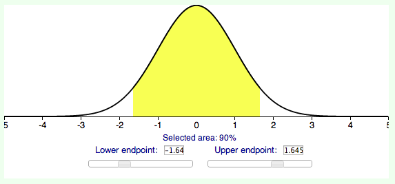



PSet 07
**********

Understand examples 26-1 to 26-7 in `SticiGui Chapter 25 <http://www.stat.berkeley.edu/~stark/SticiGui/Text/confidenceIntervals.htm>`_.  Remember, you can practive more examples by refreshing the chapter page -- most numbers are randomly generated.

In addition, below are a couple more practice problems.

.. based on exercise 26-6

[#]_ The operations manager of MDES wants to determine the average moisture content of MDES's product, DryGood. The manager takes a simple random sample of 50 bags from the shop floor, which contains about 3,000 DryGood bags. The average moisture content of the sampled bags in 21.027 points and the standard deviation is 1.571 points.

A 90% confidence interval for the mean moisture content of the DryGood bags on the shop floor would extend from _____ to _____ points.

.. based on exercise 26-3

[#]_ Since we develop ink-saving fonts at `Dimples <http://getdimples.com>`_, we'd like to gauge how many dimpled characters (e.g. 'a', 'Z', '5', or '%') contain 80 or more dimple perforations. I take a simple random sample of size 500 characters from the extensive Dimples character library. The sample percentage of characters having 80 or more dimples is 13%. A 95% confidence interval for the percentage of characters containing 80 or more dimples is from ____ to ____.

-----------

|
|
|
|
|
|
|
|

.. [#] It would extend from 20.6615 points to 21.3925 points. 

Calculate the estimated standard error of the sample mean: :math:`\frac{1.571}{50 ^ \frac{1}{2}} = 0.222173` points.

The 90% confidence interval is centered about the mean. The endpoints bounding the 90% interval is -1.645 and +1.645.

|90percent|

The confidence interval extends up and down from the mean by :math:`1.645 \cdot 0.222173 = 0.365475` points.

Thus, the confidence interval is [20.6615 points, 21.3925 points].

.. [#] [10.53%, 15.47%]

Observe how no standard deviation was provided. We have to use a `bootstrap estimate <http://www.stat.berkeley.edu/~stark/SticiGui/Text/gloss.htm#bootstrap>`_ of the standard deviation of the population to calculate the corresponding estimate of the standard error of the sample percentage: :math:`((13\% \cdot (100\% - 13\%))/500)^\frac{1}{2} = 1.504\%`.

Next, determine the endpoints on a normal curve containing 90% area under the curve.

|90percent|

The 90% confidence interval is centered about the mean. The endpoints bounding the 90% interval is -1.645 and +1.645.

The 90% confidence interval for this example determines the interval to be :math:`13\% \pm 1.645 \cdot 1.504\%` = [10.53%, 15.47%]

