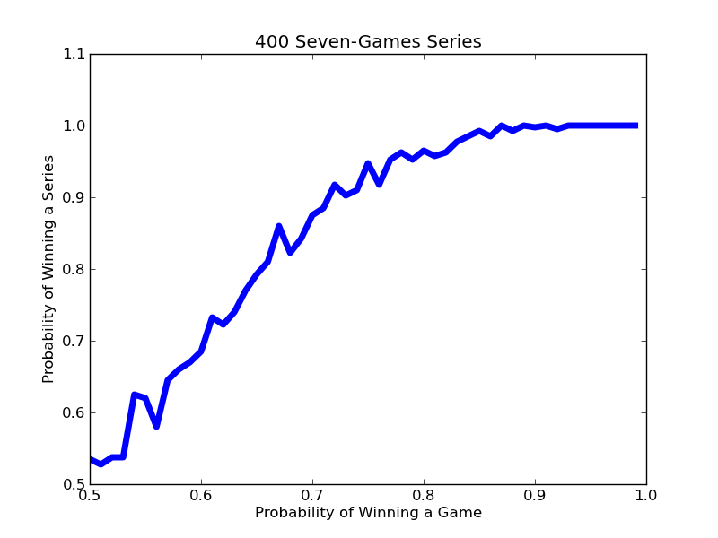



Lab 09 - World Series Sim
*************************************

Thus far we have looked at using statistical methods to help understand possible outcomes in games in which skill is not intended to play a role. It is also common to apply these methods to situations in which there is, presumably, some skill involved. Setting odds on a football match, choosing a political candidate with a chance of winning, investing in the stock market, and so on.

Almost every October two teams from American Major League Baseball meet in something called the World Series. They play each other repeatedly until one of the teams has won four games, and that team is called (not entirely appropriately) "the world champion".

Setting aside the question of whether there is reason to believe that one of the participants in the World Series is indeed the best team in the world, how likely is it that a contest that can be at most seven games long will determine which of the two participants is better?

Clearly, each year one team will emerge victorious. So the question is whether we should attribute that victory to skill or to luck. To address that question we can use something called a *p-value*. P-values are used to determine whether or not a result is *statistically significant*, with 0.05 used as the typical cutoff.

To compute a p-value one needs two things:

* A null hypothesis. This hypothesis describes the results that one would get if the results were determined entirely by chance. In this case, the null hypothesis would be that the teams are equally talented, so if the two teams were to play an infinite number of seven-game series, each would win half the time.
* An observation. Data gathered either by observing what happens or by running a simulation that one believes provides an accurate model of what would happen.

The p-value gives us the likelihood that the observation is consistent with the null hypothesis. The smaller the p-value, the more likely it is that we should reject the hypothesis that the observation is due entirely to chance. Usually, we insist that *p* be no larger than 0.05 before we consider a result to be statsitcally significant. I.e., we insist that there is no more than a 5% chance that the null hypothesis holds.

Getting back to the World Series, should we consider the results of those seven-game series to be statistically significant? That is, should we conclude that the better team did indeed win?

Type this
=======================================================

Create a new empty file in Canopy. Then type the following:

{{ ork.code('code/s09lab-worldseriessim.py|pyg') }}

Save the file as *lab09-worldseries-sim.py* and run it.

Results
~~~~~~~~~~~~

You should see the following:

|worldseries-sim|

The simulation provides us with some insight. The function ``simSeries`` has one argument, ``numSeries``, a positive integer describing the number of seven-games series to be simulated. It plots the probabbility of the better team winning the series against the probability of that team winning a single game. It varies the probability of the better team winning from 0.5 to 1.0, and produces the plot above.

Notice that for the better team to win 95% of the time (0.95 on the y-axis), it needs to be more than three times better than its opponent. That is to say, the better team needs to win, on average, three out of four games (0.75 on the x-axis). For comparison, in 2009, the two teams in the World Series had regular season winning percentages of 63.6% (New York Yankees) and 57.4% (Philadelphia Phillies). This suggests that New York should win about 52.5% of the games between the two teams. Our plot tells us that even if they were to play each other in 400 seven-games series, the Yankees would win less than 60% of the time.

Suppose we assume that these winning percentages are accurate reflections of the relative strenghts of these two teams. How many games long should the World Series be in order for us to get results that would allow us to reject the null hypothesis, i.e., the hypothesis that the teams are perfectly evenly matched?

Check out how we can extend the simulation in `the following lab section. <s09lab-2.html>`_

