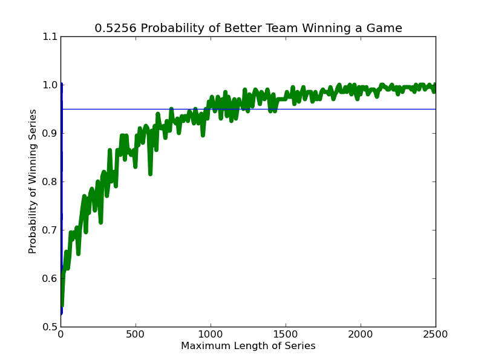



Lab 09 - World Series Length
*************************************

How many games long should the World Series be in order for us to get results that would allow us to reject the null hypothesis, i.e., the hypothesis that the teams are perfectly matched?

Type this code
=================

Copy your existing *lab09-worldseries-sim.py*, renaming it to *lab09-worldseries-length.py*. Open it and revise it to the following:

{{ ork.code('code/s09lab-worldserieslength.py|pyg') }}

Save the file and run it.

Results
~~~~~~~~~~~~

You should see the following:

|worldseries-length|

The output of ``findSeriesLength`` suggests that under these circumstances the World Series would have to be approximately 1000 games long before we could reject the null hypothesis and confidently say that the better team had almost certainly won. Scheduling a series of this length might present some practical problems.