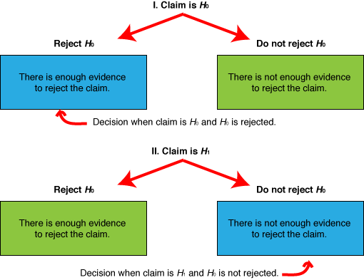



PSet 09
**********

While SticiGui explains much of the theory of hypothesis testing, this PSet shows you how to apply the testing to real data.

Here is a graphic to help you summarize te results of a hypothesis test:

|s09-htesting-outcomes|

.. 
    example 8-3 p414

[#]_ A researcher wished to see if the mean number of days that a basic, low-price, small automobile sits on a dealer's lot is 29. A sample of 30 automobile dealers has a mean of 30.1 days for basic, low-price, small automobiles. At :math:`\alpha = 0.05`, test the claim that the mean time is greater than 29 days. The standard deviation of the population is 3.8 days.

.. 
    example 8-5 p415

[#]_ The Medical Rehabilitation Education Foundation reports that the average cost of rehabilitation for stroke victims is $24,672. To see if the avergae cost of rehabilitation is different at a particular hospital, a researcher selects a random sample of 35 stroke victims at the hospital and finds that the average cost of their rehabilitation is $26,343. The standard deviation of the population is $3,251. At :math:`\alpha = 0.01`, can it be concluded that the average cost of stroke rehabilitation at a particular hospital is different from $24,672?

..
    example 8-6 p419

[#]_ A researcher wishes to test the claim that the average cost of tuition and fees at a four-year public college is greater than $5700. She selects a random sample of 36 four-year public colleges and finds the mean to be $5950. The population standard deviation is $659. Is there evidence to support the claim that :math:`\alpha = 0.05`? Use the *P*-value method.

|
|
|
|
|
|
|
|

Solutions
==============

.. [#] 
    Reject the claim. The sample mean of 30.1 is not significantly higher than the hypothesized population mean of 29. Worked solution:

    Step 1: State hypothesis and identify the claim.

    :math:`H_0: \mu = 29` and :math:`H_1: \mu > 29` (claim)

    Step 2: Find the critical value. Since :math:`\alpha = 0.05` and the test is a right-tailed test, the critical value is :math:`z = +1.65`.

    Step 3: Compute the test value.

    :math:`z = \dfrac{\overline{X} - \mu}{\sigma/\sqrt{n}} = \dfrac{30.1-29}{3.8/\sqrt{30}} = 1.59`

    Step 4: Make the decision. Since the test value, +1.59, is less than the critical value, +1.65, and is not in the critical region, the decision is to not reject the null hypothesis.

    |s09pset-nullhypothesis-high-1.59-1.65|

    .. |s09pset-nullhypothesis-high-1.59-1.65| image:: images/s09pset-nullhypothesis-high-1.59-1.65.png

.. [#]
    There is enough evidence to support the claim that the average cost of rehabilitation at the particular hospital is different from $24,672. Worked solution:

    Step 1: State the hypotheses and identify the claim.

    :math:`H_0: \mu = \$24,672` and :math:`H_1: \mu \neq \$24,672` (claim)

    Step 2: Find the critical values. Since :math:`\alpha = 0.01` and the test is a two-tailed test, the critical values are +2.58 and -2.58.

    Step 3: Compute the test value.

    :math:`z = \dfrac{\overline{X}-\mu}{\sigma/\sqrt{n}} = \dfrac{26,343-24,672}{3251/\sqrt{35}} = 3.04`

    Step 4: Make the decision. Reject the nul hypothesis, since the test value falls in the critical region.

    |s09pset-nullhypothesis-lowhigh-2.58-3.04|

    .. |s09pset-nullhypothesis-lowhigh-2.58-3.04| image:: images/s09pset-nullhypothesis-lowhigh-2.58-3.04.png

.. [#]
    There is enough evidence to support the claim that the tuition and fees at four-year public colleges are greater than $5700. Worked solution:

    Step 1: State the hypotheses and identify the claim. 

    :math:`H_0 = \$5700` and :math:`H_1: \mu > \$5700` (claim)

    Step 2: Compute the test value.

    :math:`z = \dfrac{\overline{X}-\mu}{\sigma/\sqrt{n}}= \dfrac{5950-5700}{659/\sqrt{36}} = 2.28`

    Step 3: Find the *P*-value. Find the corresponding area under the normal distribution for *z* = 2.28. It is about 0.9887. Subtract this value from 1.00 to find the area in the right tail.

    :math:`1.0000 - 0.9887 = 0.0113`

    Hence the *P*-value is 0.0113.

    Step 4: Make the decision. Since *P*-value is less than 0.05, the decision is to reject the null hypothesis.

    Step 5: Summarize the results. There is enough evidence to support the claim that the tutition and fees at four-year public colleges are greater than $5700.

    |s09pset-nullhypothesis-high-5900dollars|

    .. |s09pset-nullhypothesis-high-5900dollars| image:: images/s09pset-nullhypothesis-high-5900dollars.png
