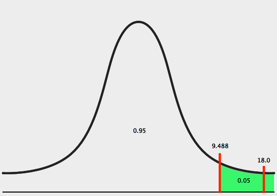



PSet 10
**********

Use SticiGui's `Area under the chi-square curve tool <http://www.stat.berkeley.edu/~stark/Java/Html/chiHiLite.htm>`_

In addition to the examples from SticiGui Chapter 31, work through the following practice problems.

.. Elem Stats. page 594

[#]_ Suppose, as a market analyst, you wished to see whether consumers have any preference among five flavors of a new fruit soda. A sample of 100 people provided the following data:

======  ==========  ======  ====    =====
Cherry  Strawberry  Orange  Lime    Grape
======  ==========  ======  ====    =====
32      28          16      14      10
======  ==========  ======  ====    =====

Is there enough evidence to reject the claim that there is no preference in the selection of fruit soda flavors? Let :math:`\alpha=0.05`. 

[#]_ A researcher read that firearm-related deaths for people aged 1 to 18 were distributed as follows: 74% were accidental, 16% were homicides, and 10% were suicides. In her district, there were 68 accidental deaths, 27 homicides, and 5 suicides during the past year. At :math:`\alpha = 0.10`, test the claim that the percentages are equal.

-------

|
|
|
|
|
|
|
|
|

.. [#] There is enough evidence to reject the claim that consumers show no preferences for the flavors. 

Step 1: State hypotheses and identify claim.

:math:`H_0` : Consumers show no preference for flavors (claim).

:math:`H_1` : Consumers show a preference.

Step 2: Find the critical value. The degrees of freedom are :math:`5-1=4` because there are 5 flavors from which to choose, and :math:`\alpha=0.05`. Hence, the critical value, as calculated with SticiGui's `Area under the chi-square curve tool <http://www.stat.berkeley.edu/~stark/Java/Html/chiHiLite.htm>`_, is 9.488.

Step 3: Compute the test value using the Chi-Square Goodness-of-Fit Test: :math:`\chi^2=\sum\dfrac{(O-E)^2}{E}`

The test value is computed by subtracting the expected value from the corresponding observed value, sqaring ther esult and dividing by the expected value, and finding the sum. The expected value for each categor is 20, since, if flavor is a random choice and there are 100 samples in which each individual chooses from 5 flavors, there should be approximately :math:`\frac{100}{5}=20` individuals per flavor.

.. math::

    \chi^2 =\sum\dfrac{(O-E)^2}{E}
    =\dfrac{(32-20)^2}{20} + \dfrac{(28-20)^2}{20} + \dfrac{(16-20)^2}{20} + \dfrac{(14-20)^2}{20} + \dfrac{(10-20)^2}{20}
    = 18.0

Step 4: Make the decision. The decision is to reject the nul hypothesis, since :math:`18.0 > 9.488`.

|s10pset-nullhypothesis-high-9.488-18.0|

Step 5: Summarize the results. There is enough evidence to reject the claim that consumers show no preference for the flavors.

.. [#] There is enough evidence to reject the claim that the distribution is 74% accidental, 16% homicides, and 10% suicides.

Step 1: State the hypotheses and identify the claim:

:math:`H_0:` The deaths due to firearms for people aged 1 through 18 are distributed as follows: 74% accidental, 16% homicides, and 10% suicides (claim).

:math:`H_1:` The distribution is not the same as stated in the null hypothesis.

Step 2: Find the critical value. Since :math:`\alpha = 0.10` and the degrees of freedom are :math:`3-1=2`, the critical value is :math:`4.605`.

Step 3: Compute the test value. The expected values are as follows:

.. math::

    0.75 \cdot 100 = 75 \\
    0.16 \cdot 100 = 16 \\
    0.10 \cdot 100 = 10

Calculate :math:`\chi^2`:

.. math::

    \chi^2 =\sum\dfrac{(O-E)^2}{E} = \dfrac{(68-74)^2}{74} + \dfrac{(27-74)^2}{74} + \dfrac{(5-74)^2}{74} = 10.549

Step 4: Reject the null hypothesis, since :math:`10.549 > 4.605`.

Step 5: Summarize the results. There is enough evidence to reject the claim that the distribution is 74% accidental, 16% homicides, and 10% suicides.

 
